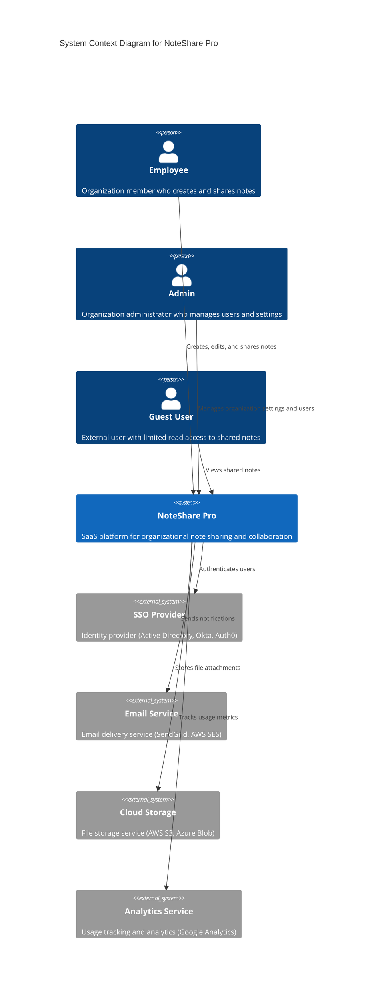
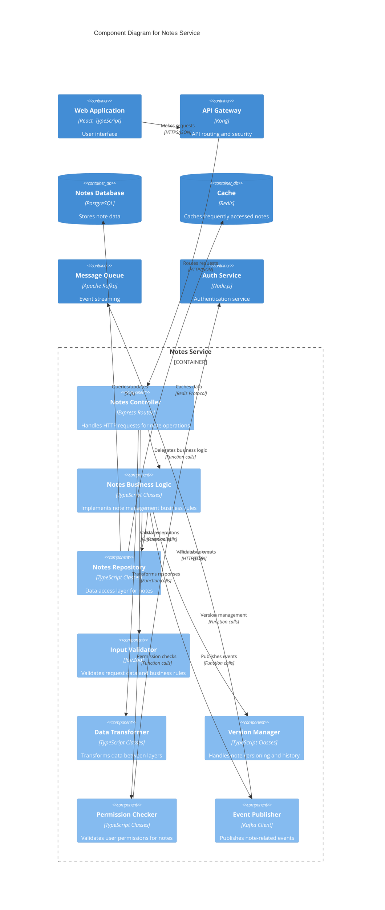
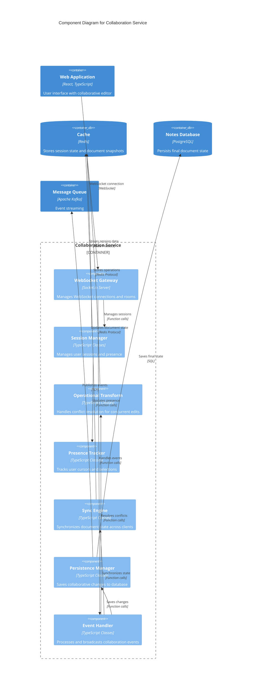

# C4 Architecture Diagrams

**Phase**: 03 - Technical Discovery & Architecture (aka: Solution Architecture, Systems Design, Tech Blueprint, Foundations Sprint)  
**Deliverable Type**: System Architecture Visualization  
**Template Purpose**: Provide visual representation of system architecture using C4 model methodology  
**Last Updated**: November 2024

## Overview

*This document contains C4 (Context, Containers, Components, Code) diagrams that visualize the NoteShare Pro architecture at different levels of detail. C4 diagrams help stakeholders understand the system structure from high-level context down to detailed component interactions.*

The C4 model provides a hierarchical approach to software architecture diagrams:
- **Level 1 - Context**: System context and external dependencies
- **Level 2 - Container**: High-level technology choices and responsibilities
- **Level 3 - Component**: Internal structure of individual containers
- **Level 4 - Code**: Implementation details (optional, usually in IDE)

## Level 1: System Context Diagram

*Shows how the software system fits into the world around it - who uses it and what other systems it interacts with.*



## Level 2: Container Diagram

*Shows the high-level shape of the software architecture and how responsibilities are distributed across containers.*

```mermaid
C4Container
    title Container Diagram for NoteShare Pro

    Person(employee, "Employee", "Organization member")
    Person(admin, "Admin", "Organization administrator")

    Container_Boundary(c1, "NoteShare Pro") {
        Container(web, "Web Application", "React, TypeScript", "Provides note sharing functionality via web browser")
        Container(mobile, "Mobile App", "React Native", "Provides note sharing functionality via mobile device")
        
        Container(api, "API Gateway", "Kong/AWS API Gateway", "Routes requests, handles authentication, rate limiting")
        
        Container(auth, "Auth Service", "Node.js, Express", "Handles user authentication and authorization")
        Container(notes, "Notes Service", "Node.js, Express", "Manages note CRUD operations and metadata")
        Container(collab, "Collaboration Service", "Node.js, Socket.io", "Handles real-time collaborative editing")
        Container(search, "Search Service", "Node.js, Express", "Provides search and discovery functionality")
        Container(notify, "Notification Service", "Node.js, Express", "Manages email and in-app notifications")
        
        ContainerDb(userdb, "User Database", "PostgreSQL", "Stores user profiles, organizations, permissions")
        ContainerDb(notedb, "Notes Database", "PostgreSQL", "Stores note content, metadata, versions")
        ContainerDb(searchdb, "Search Index", "Elasticsearch", "Indexes note content for full-text search")
        ContainerDb(cache, "Cache", "Redis", "Caches session data and frequently accessed content")
        ContainerDb(files, "File Storage", "AWS S3", "Stores note attachments and media files")
        
        Container(queue, "Message Queue", "Apache Kafka", "Handles asynchronous communication between services")
    }

    System_Ext(sso, "SSO Provider", "Identity provider")
    System_Ext(email, "Email Service", "Email delivery service")

    Rel(employee, web, "Uses", "HTTPS")
    Rel(employee, mobile, "Uses", "HTTPS")
    Rel(admin, web, "Uses", "HTTPS")

    Rel(web, api, "Makes API calls", "HTTPS/JSON")
    Rel(mobile, api, "Makes API calls", "HTTPS/JSON")

    Rel(api, auth, "Routes auth requests", "HTTP/JSON")
    Rel(api, notes, "Routes note requests", "HTTP/JSON")
    Rel(api, search, "Routes search requests", "HTTP/JSON")
    
    Rel(web, collab, "Real-time updates", "WebSocket")
    Rel(mobile, collab, "Real-time updates", "WebSocket")

    Rel(auth, userdb, "Reads/writes user data", "SQL")
    Rel(auth, sso, "Validates tokens", "HTTPS/OIDC")
    
    Rel(notes, notedb, "Reads/writes note data", "SQL")
    Rel(notes, files, "Stores attachments", "HTTPS/REST")
    Rel(notes, queue, "Publishes events", "TCP")
    
    Rel(collab, cache, "Stores session state", "Redis Protocol")
    Rel(collab, queue, "Publishes events", "TCP")
    
    Rel(search, searchdb, "Queries/indexes content", "HTTP/JSON")
    Rel(search, queue, "Consumes events", "TCP")
    
    Rel(notify, queue, "Consumes events", "TCP")
    Rel(notify, email, "Sends emails", "HTTPS/REST")
```



## Level 3: Component Diagram - Notes Service

*Shows how the Notes Service is made up of components, their responsibilities and technology/implementation details.*



## Level 3: Component Diagram - Collaboration Service

*Shows the internal structure of the real-time collaboration service and its components.*



## Deployment Diagram

*Shows how containers are deployed to infrastructure and the relationships between deployment nodes.*

```mermaid
C4Deployment
    title Deployment Diagram for NoteShare Pro

    Deployment_Node(cdn, "CDN", "CloudFlare/AWS CloudFront") {
        Container(static, "Static Assets", "HTML, CSS, JS", "Web application static files")
    }

    Deployment_Node(lb, "Load Balancer", "AWS ALB/NGINX") {
        Container(proxy, "Reverse Proxy", "NGINX", "Routes traffic to services")
    }

    Deployment_Node(k8s, "Kubernetes Cluster", "AWS EKS/GKE") {
        Deployment_Node(web_pod, "Web Tier Pods") {
            Container(api_gw, "API Gateway", "Kong", "API routing and security")
        }
        
        Deployment_Node(app_pods, "Application Tier Pods") {
            Container(auth_svc, "Auth Service", "Node.js", "Authentication service")
            Container(notes_svc, "Notes Service", "Node.js", "Note management service")
            Container(collab_svc, "Collaboration Service", "Node.js", "Real-time collaboration")
            Container(search_svc, "Search Service", "Node.js", "Search functionality")
        }
    }

    Deployment_Node(data_tier, "Data Tier", "AWS RDS/Managed Services") {
        ContainerDb(postgres, "PostgreSQL", "AWS RDS", "Primary database")
        ContainerDb(redis, "Redis", "AWS ElastiCache", "Cache and sessions")
        ContainerDb(elastic, "Elasticsearch", "AWS OpenSearch", "Search index")
        ContainerDb(s3, "S3 Storage", "AWS S3", "File storage")
    }

    Deployment_Node(messaging, "Messaging", "AWS MSK/Confluent") {
        Container(kafka, "Kafka Cluster", "Apache Kafka", "Event streaming")
    }

    Rel(cdn, lb, "Serves static content", "HTTPS")
    Rel(lb, api_gw, "Routes API traffic", "HTTPS")
    
    Rel(api_gw, auth_svc, "Auth requests", "HTTP")
    Rel(api_gw, notes_svc, "Note requests", "HTTP")
    Rel(api_gw, search_svc, "Search requests", "HTTP")
    
    Rel(auth_svc, postgres, "User data", "PostgreSQL")
    Rel(notes_svc, postgres, "Note data", "PostgreSQL")
    Rel(collab_svc, redis, "Session state", "Redis")
    Rel(search_svc, elastic, "Search queries", "HTTP")
    
    Rel(notes_svc, s3, "File storage", "HTTPS")
    Rel(notes_svc, kafka, "Events", "TCP")
    Rel(collab_svc, kafka, "Events", "TCP")
```

## Diagram Usage Guidelines

*Instructions for using and maintaining these C4 diagrams in your own projects.*

### Creating C4 Diagrams
1. **Start with Context**: Begin with Level 1 to establish system boundaries
2. **Add Containers**: Define major technology choices and responsibilities
3. **Detail Components**: Focus on the most complex or critical containers
4. **Update Regularly**: Keep diagrams current with architecture changes

### Diagram Tools
- **Mermaid**: Text-based diagrams (used in this template)
- **Draw.io**: Visual diagramming tool with C4 templates
- **PlantUML**: Code-based diagram generation
- **Structurizr**: Purpose-built C4 modeling tool

### Best Practices
- **Keep it Simple**: Don't overcomplicate diagrams with too much detail
- **Use Consistent Naming**: Maintain consistent terminology across all levels
- **Focus on Intent**: Show the architectural intent, not implementation details
- **Version Control**: Store diagrams in version control with code
- **Regular Reviews**: Review and update during architecture reviews

### Template Customization
- Replace "NoteShare Pro" with your actual system name
- Update technology choices to match your stack
- Modify component boundaries based on your service design
- Add or remove external systems based on your integrations
- Adjust deployment topology to match your infrastructure

---

*These C4 diagrams provide a comprehensive view of the NoteShare Pro architecture. Use this template to create similar diagrams for your own system by replacing the example components and relationships with your specific architecture details. Remember to keep diagrams updated as your system evolves.*