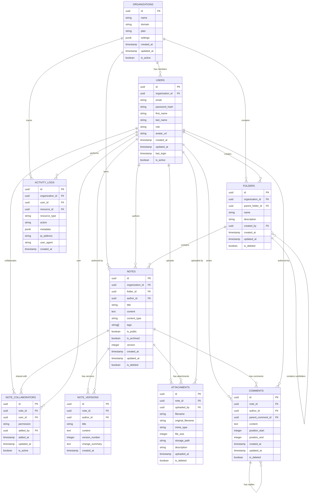

# Data Model & Entity Relationship Diagram

**Phase**: 03 - Technical Discovery & Architecture (aka: Solution Architecture, Systems Design, Tech Blueprint, Foundations Sprint)  
**Deliverable Type**: Database Design Specification  
**Template Purpose**: Define data models, relationships, and database schema for the SaaS platform  
**Last Updated**: November 2024

## Overview

*This document defines the data model for NoteShare Pro, including entity relationships, database schema, and data constraints. The design supports multi-tenancy, scalability, and data integrity while enabling efficient queries for note sharing and collaboration features.*

### Data Model Principles
- **Multi-Tenant Architecture**: Organization-based data isolation
- **Referential Integrity**: Foreign key constraints and cascading rules
- **Audit Trail**: Created/updated timestamps on all entities
- **Soft Deletes**: Preserve data for recovery and compliance
- **Indexing Strategy**: Optimized for common query patterns
- **Data Types**: Appropriate types for performance and storage efficiency

## Entity Relationship Diagram

*Visual representation of the data model showing entities, attributes, and relationships.*



## Entity Definitions

*Detailed specifications for each entity including attributes, constraints, and business rules.*

### Organizations Table
```sql
CREATE TABLE organizations (
    id UUID PRIMARY KEY DEFAULT gen_random_uuid(),
    name VARCHAR(255) NOT NULL,
    domain VARCHAR(255) UNIQUE NOT NULL,
    plan VARCHAR(50) NOT NULL DEFAULT 'starter',
    settings JSONB NOT NULL DEFAULT '{}',
    created_at TIMESTAMP WITH TIME ZONE DEFAULT NOW(),
    updated_at TIMESTAMP WITH TIME ZONE DEFAULT NOW(),
    is_active BOOLEAN DEFAULT true,
    
    CONSTRAINT valid_plan CHECK (plan IN ('starter', 'professional', 'enterprise')),
    CONSTRAINT valid_domain CHECK (domain ~ '^[a-zA-Z0-9][a-zA-Z0-9-]*[a-zA-Z0-9]*\.[a-zA-Z]{2,}$')
);

CREATE INDEX idx_organizations_domain ON organizations(domain);
CREATE INDEX idx_organizations_active ON organizations(is_active);
```

**Business Rules:**
- Organization domain must be unique across the platform
- Settings JSONB field stores plan-specific configuration
- Soft delete not implemented - organizations are deactivated instead

### Users Table
```sql
CREATE TABLE users (
    id UUID PRIMARY KEY DEFAULT gen_random_uuid(),
    organization_id UUID NOT NULL REFERENCES organizations(id) ON DELETE CASCADE,
    email VARCHAR(255) NOT NULL,
    password_hash VARCHAR(255) NOT NULL,
    first_name VARCHAR(100) NOT NULL,
    last_name VARCHAR(100) NOT NULL,
    role VARCHAR(50) NOT NULL DEFAULT 'member',
    avatar_url TEXT,
    created_at TIMESTAMP WITH TIME ZONE DEFAULT NOW(),
    updated_at TIMESTAMP WITH TIME ZONE DEFAULT NOW(),
    last_login TIMESTAMP WITH TIME ZONE,
    is_active BOOLEAN DEFAULT true,
    
    CONSTRAINT valid_role CHECK (role IN ('admin', 'member', 'viewer')),
    CONSTRAINT valid_email CHECK (email ~ '^[A-Za-z0-9._%+-]+@[A-Za-z0-9.-]+\.[A-Za-z]{2,}$'),
    UNIQUE(organization_id, email)
);

CREATE INDEX idx_users_org_email ON users(organization_id, email);
CREATE INDEX idx_users_org_active ON users(organization_id, is_active);
CREATE INDEX idx_users_last_login ON users(last_login);
```

**Business Rules:**
- Email must be unique within an organization
- Password hash uses bcrypt with minimum 12 rounds
- Role determines permissions within the organization
- Cascade delete when organization is deleted

### Folders Table
```sql
CREATE TABLE folders (
    id UUID PRIMARY KEY DEFAULT gen_random_uuid(),
    organization_id UUID NOT NULL REFERENCES organizations(id) ON DELETE CASCADE,
    parent_folder_id UUID REFERENCES folders(id) ON DELETE CASCADE,
    name VARCHAR(255) NOT NULL,
    description TEXT,
    created_by UUID NOT NULL REFERENCES users(id) ON DELETE SET NULL,
    created_at TIMESTAMP WITH TIME ZONE DEFAULT NOW(),
    updated_at TIMESTAMP WITH TIME ZONE DEFAULT NOW(),
    is_deleted BOOLEAN DEFAULT false,
    
    CONSTRAINT no_self_reference CHECK (id != parent_folder_id),
    UNIQUE(organization_id, parent_folder_id, name, is_deleted) DEFERRABLE
);

CREATE INDEX idx_folders_org_parent ON folders(organization_id, parent_folder_id);
CREATE INDEX idx_folders_org_active ON folders(organization_id, is_deleted);
CREATE INDEX idx_folders_created_by ON folders(created_by);
```

**Business Rules:**
- Folder names must be unique within the same parent folder
- Supports hierarchical folder structure with parent-child relationships
- Soft delete preserves folder structure for recovery
- Prevents circular references in folder hierarchy

### Notes Table
```sql
CREATE TABLE notes (
    id UUID PRIMARY KEY DEFAULT gen_random_uuid(),
    organization_id UUID NOT NULL REFERENCES organizations(id) ON DELETE CASCADE,
    folder_id UUID REFERENCES folders(id) ON DELETE SET NULL,
    author_id UUID NOT NULL REFERENCES users(id) ON DELETE SET NULL,
    title VARCHAR(500) NOT NULL,
    content TEXT NOT NULL DEFAULT '',
    content_type VARCHAR(50) NOT NULL DEFAULT 'markdown',
    tags TEXT[] DEFAULT '{}',
    is_public BOOLEAN DEFAULT false,
    is_archived BOOLEAN DEFAULT false,
    version INTEGER DEFAULT 1,
    created_at TIMESTAMP WITH TIME ZONE DEFAULT NOW(),
    updated_at TIMESTAMP WITH TIME ZONE DEFAULT NOW(),
    is_deleted BOOLEAN DEFAULT false,
    
    CONSTRAINT valid_content_type CHECK (content_type IN ('markdown', 'html', 'plain')),
    CONSTRAINT valid_version CHECK (version > 0)
);

CREATE INDEX idx_notes_org_folder ON notes(organization_id, folder_id);
CREATE INDEX idx_notes_org_active ON notes(organization_id, is_deleted);
CREATE INDEX idx_notes_author ON notes(author_id);
CREATE INDEX idx_notes_tags ON notes USING GIN(tags);
CREATE INDEX idx_notes_public ON notes(is_public) WHERE is_public = true;
CREATE INDEX idx_notes_updated ON notes(updated_at DESC);
CREATE INDEX idx_notes_search ON notes USING GIN(to_tsvector('english', title || ' ' || content));
```

**Business Rules:**
- Content type determines how content is rendered and processed
- Tags array enables flexible categorization and filtering
- Version number increments with each significant update
- Full-text search index on title and content

### Note Collaborators Table
```sql
CREATE TABLE note_collaborators (
    id UUID PRIMARY KEY DEFAULT gen_random_uuid(),
    note_id UUID NOT NULL REFERENCES notes(id) ON DELETE CASCADE,
    user_id UUID NOT NULL REFERENCES users(id) ON DELETE CASCADE,
    permission VARCHAR(50) NOT NULL DEFAULT 'read',
    added_by UUID NOT NULL REFERENCES users(id) ON DELETE SET NULL,
    added_at TIMESTAMP WITH TIME ZONE DEFAULT NOW(),
    updated_at TIMESTAMP WITH TIME ZONE DEFAULT NOW(),
    is_active BOOLEAN DEFAULT true,
    
    CONSTRAINT valid_permission CHECK (permission IN ('read', 'write', 'admin')),
    UNIQUE(note_id, user_id)
);

CREATE INDEX idx_collaborators_note ON note_collaborators(note_id, is_active);
CREATE INDEX idx_collaborators_user ON note_collaborators(user_id, is_active);
CREATE INDEX idx_collaborators_added_by ON note_collaborators(added_by);
```

**Business Rules:**
- Each user can have only one permission level per note
- Permission levels: read (view only), write (edit), admin (manage sharing)
- Tracks who added the collaborator for audit purposes
- Soft delete preserves collaboration history

### Note Versions Table
```sql
CREATE TABLE note_versions (
    id UUID PRIMARY KEY DEFAULT gen_random_uuid(),
    note_id UUID NOT NULL REFERENCES notes(id) ON DELETE CASCADE,
    author_id UUID NOT NULL REFERENCES users(id) ON DELETE SET NULL,
    title VARCHAR(500) NOT NULL,
    content TEXT NOT NULL,
    version_number INTEGER NOT NULL,
    change_summary TEXT,
    created_at TIMESTAMP WITH TIME ZONE DEFAULT NOW(),
    
    CONSTRAINT valid_version_number CHECK (version_number > 0),
    UNIQUE(note_id, version_number)
);

CREATE INDEX idx_versions_note ON note_versions(note_id, version_number DESC);
CREATE INDEX idx_versions_author ON note_versions(author_id);
CREATE INDEX idx_versions_created ON note_versions(created_at DESC);
```

**Business Rules:**
- Stores complete snapshot of note content for each version
- Version numbers must be sequential and unique per note
- Change summary provides human-readable description of changes
- Immutable records - versions are never updated or deleted

### Attachments Table
```sql
CREATE TABLE attachments (
    id UUID PRIMARY KEY DEFAULT gen_random_uuid(),
    note_id UUID NOT NULL REFERENCES notes(id) ON DELETE CASCADE,
    uploaded_by UUID NOT NULL REFERENCES users(id) ON DELETE SET NULL,
    filename VARCHAR(255) NOT NULL,
    original_filename VARCHAR(255) NOT NULL,
    mime_type VARCHAR(100) NOT NULL,
    file_size INTEGER NOT NULL,
    storage_path TEXT NOT NULL,
    description TEXT,
    uploaded_at TIMESTAMP WITH TIME ZONE DEFAULT NOW(),
    is_deleted BOOLEAN DEFAULT false,
    
    CONSTRAINT valid_file_size CHECK (file_size > 0),
    CONSTRAINT valid_filename CHECK (filename ~ '^[a-zA-Z0-9._-]+$')
);

CREATE INDEX idx_attachments_note ON attachments(note_id, is_deleted);
CREATE INDEX idx_attachments_uploader ON attachments(uploaded_by);
CREATE INDEX idx_attachments_mime ON attachments(mime_type);
CREATE INDEX idx_attachments_size ON attachments(file_size);
```

**Business Rules:**
- Filename is sanitized version for storage, original_filename preserves user input
- File size limits enforced at application level based on organization plan
- Storage path points to object storage location (S3, etc.)
- Soft delete preserves file references for recovery

### Comments Table
```sql
CREATE TABLE comments (
    id UUID PRIMARY KEY DEFAULT gen_random_uuid(),
    note_id UUID NOT NULL REFERENCES notes(id) ON DELETE CASCADE,
    author_id UUID NOT NULL REFERENCES users(id) ON DELETE SET NULL,
    parent_comment_id UUID REFERENCES comments(id) ON DELETE CASCADE,
    content TEXT NOT NULL,
    position_start INTEGER,
    position_end INTEGER,
    created_at TIMESTAMP WITH TIME ZONE DEFAULT NOW(),
    updated_at TIMESTAMP WITH TIME ZONE DEFAULT NOW(),
    is_deleted BOOLEAN DEFAULT false,
    
    CONSTRAINT valid_position CHECK (
        (position_start IS NULL AND position_end IS NULL) OR
        (position_start IS NOT NULL AND position_end IS NOT NULL AND position_start <= position_end)
    ),
    CONSTRAINT no_self_reference CHECK (id != parent_comment_id)
);

CREATE INDEX idx_comments_note ON comments(note_id, is_deleted);
CREATE INDEX idx_comments_author ON comments(author_id);
CREATE INDEX idx_comments_parent ON comments(parent_comment_id);
CREATE INDEX idx_comments_position ON comments(note_id, position_start, position_end);
```

**Business Rules:**
- Supports threaded comments with parent-child relationships
- Position fields enable inline comments anchored to specific text
- Content supports markdown formatting
- Soft delete preserves comment threads

### Activity Logs Table
```sql
CREATE TABLE activity_logs (
    id UUID PRIMARY KEY DEFAULT gen_random_uuid(),
    organization_id UUID NOT NULL REFERENCES organizations(id) ON DELETE CASCADE,
    user_id UUID REFERENCES users(id) ON DELETE SET NULL,
    resource_id UUID,
    resource_type VARCHAR(50) NOT NULL,
    action VARCHAR(100) NOT NULL,
    metadata JSONB DEFAULT '{}',
    ip_address INET,
    user_agent TEXT,
    created_at TIMESTAMP WITH TIME ZONE DEFAULT NOW(),
    
    CONSTRAINT valid_resource_type CHECK (resource_type IN ('note', 'folder', 'user', 'organization', 'attachment'))
);

CREATE INDEX idx_activity_org_time ON activity_logs(organization_id, created_at DESC);
CREATE INDEX idx_activity_user_time ON activity_logs(user_id, created_at DESC);
CREATE INDEX idx_activity_resource ON activity_logs(resource_type, resource_id);
CREATE INDEX idx_activity_action ON activity_logs(action);
```

**Business Rules:**
- Immutable audit trail of all significant system actions
- Metadata JSONB field stores action-specific details
- IP address and user agent for security analysis
- Partitioned by month for performance and archival

## Data Relationships

*Detailed explanation of entity relationships and their business significance.*

### Organization-Centric Multi-Tenancy
- All user data is scoped to an organization for complete data isolation
- Organization settings control feature availability and limits
- Cascade deletes ensure complete data removal when organization is deleted

### Hierarchical Folder Structure
- Folders support unlimited nesting depth with parent-child relationships
- Folder deletion cascades to child folders and contained notes
- Folder permissions inherited from parent folders

### Note Collaboration Model
- Notes can have multiple collaborators with different permission levels
- Collaboration permissions are independent of folder permissions
- Public notes bypass organization boundaries for sharing

### Version Control System
- Complete version history preserved for all note changes
- Version numbers are sequential and immutable
- Change summaries provide human-readable change descriptions

### Comment Threading
- Comments support unlimited reply depth with parent-child relationships
- Inline comments anchored to specific text positions
- Comment deletion preserves thread structure

## Indexing Strategy

*Database indexes optimized for common query patterns and performance requirements.*

### Primary Indexes
- All primary keys use UUID with B-tree indexes
- Foreign key relationships have corresponding indexes
- Unique constraints on business-critical combinations

### Query-Specific Indexes
- **Full-text search**: GIN indexes on note title and content
- **Tag filtering**: GIN indexes on note tags array
- **Time-based queries**: B-tree indexes on timestamp columns
- **Multi-tenant queries**: Composite indexes with organization_id

### Performance Considerations
- Partial indexes on boolean flags (is_active, is_deleted, is_public)
- Covering indexes for frequently accessed column combinations
- Index maintenance during high-volume operations

## Data Migration Strategy

*Approach for schema changes and data migrations in production.*

### Migration Principles
- **Zero-downtime**: All migrations must be backward compatible
- **Rollback capability**: Every migration includes rollback scripts
- **Data validation**: Post-migration data integrity checks
- **Performance impact**: Migrations scheduled during low-usage periods

### Schema Versioning
- Database schema version tracked in metadata table
- Application startup validates schema compatibility
- Automated migration execution with proper locking

### Data Archival
- Soft-deleted records archived after retention period
- Activity logs partitioned and archived monthly
- File attachments moved to cold storage after archival

---

*This data model provides a robust foundation for the NoteShare Pro platform. Use this template to design your own data model by replacing the example entities and relationships with your specific requirements. Remember to consider scalability, performance, and data integrity constraints when adapting this design.*