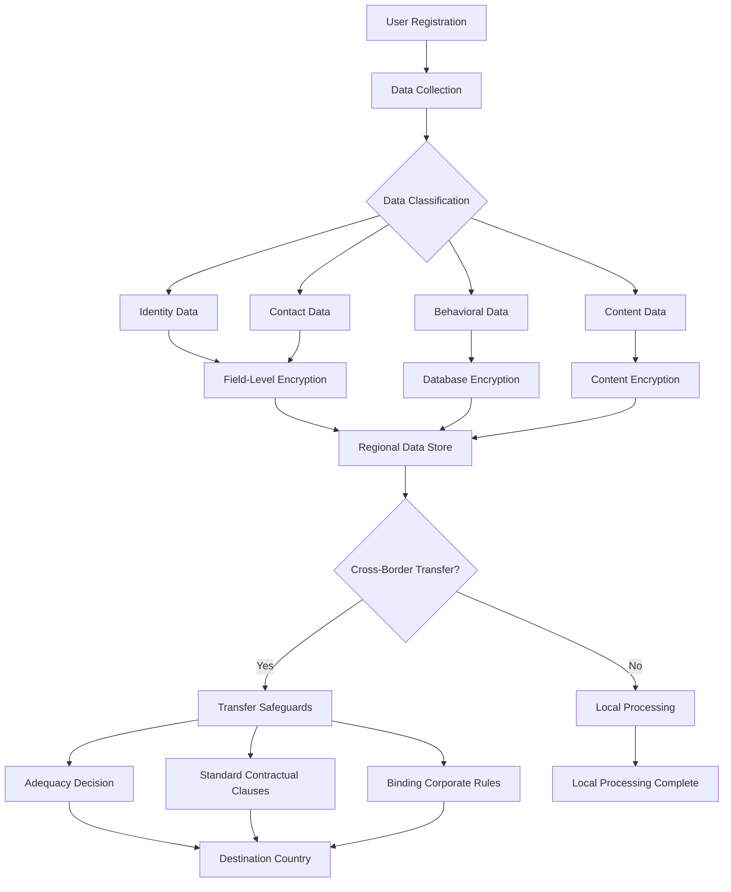
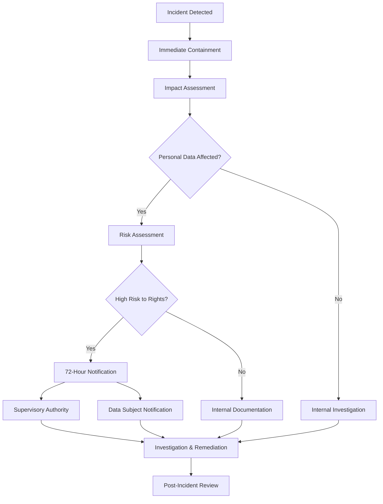

# Data Residency & Privacy Plan

**Phase**: 03 - Technical Discovery & Architecture (aka: Solution Architecture, Systems Design, Tech Blueprint, Foundations Sprint)  
**Deliverable Type**: Data Governance & Compliance Strategy  
**Template Purpose**: Define data residency requirements, privacy controls, and regulatory compliance for the SaaS platform  
**Last Updated**: November 2024

## Overview

*This document defines the data residency and privacy strategy for NoteShare Pro, ensuring compliance with global privacy regulations while meeting customer requirements for data sovereignty and protection. The plan addresses GDPR, CCPA, and other regional privacy laws while maintaining operational efficiency.*

Data residency refers to the physical or geographic location where data is stored and processed. Privacy controls ensure personal data is handled according to applicable laws and customer requirements.

## Regulatory Landscape

*Overview of applicable privacy regulations and their requirements.*

### Global Privacy Regulations

#### General Data Protection Regulation (GDPR) - EU
- **Scope**: EU residents' personal data regardless of processing location
- **Key Requirements**:
  - Lawful basis for processing personal data
  - Data subject rights (access, rectification, erasure, portability)
  - Data Protection Impact Assessments (DPIA) for high-risk processing
  - Privacy by design and by default
  - Breach notification within 72 hours
- **Penalties**: Up to 4% of annual global turnover or €20 million

#### California Consumer Privacy Act (CCPA) - US
- **Scope**: California residents' personal information
- **Key Requirements**:
  - Right to know what personal information is collected
  - Right to delete personal information
  - Right to opt-out of sale of personal information
  - Non-discrimination for exercising privacy rights
- **Penalties**: Up to $7,500 per intentional violation

#### Personal Information Protection and Electronic Documents Act (PIPEDA) - Canada
- **Scope**: Personal information collected in commercial activities
- **Key Requirements**:
  - Consent for collection, use, and disclosure
  - Limited collection and use of personal information
  - Accuracy and safeguards for personal information
- **Penalties**: Up to CAD $100,000 per violation

### Regional Data Localization Laws

#### Data Localization Requirements by Region
```javascript
const dataLocalizationRequirements = {
  'EU': {
    regulation: 'GDPR',
    requirements: [
      'Adequate level of protection for transfers outside EU',
      'Standard Contractual Clauses (SCCs) for third country transfers',
      'Data Processing Agreements with processors'
    ],
    allowedTransfers: ['Adequacy decisions', 'SCCs', 'BCRs', 'Derogations']
  },
  
  'Russia': {
    regulation: 'Federal Law 242-FZ',
    requirements: [
      'Personal data of Russian citizens must be stored in Russia',
      'Cross-border transfer requires consent or legal basis'
    ],
    allowedTransfers: ['Consent', 'Adequacy list', 'Contractual safeguards']
  },
  
  'China': {
    regulation: 'Cybersecurity Law & PIPL',
    requirements: [
      'Critical information infrastructure data stored locally',
      'Security assessment for cross-border transfers'
    ],
    allowedTransfers: ['Security assessment', 'Certification', 'Standard contracts']
  },
  
  'India': {
    regulation: 'Personal Data Protection Bill (Draft)',
    requirements: [
      'Sensitive personal data processing restrictions',
      'Data localization for critical personal data'
    ],
    allowedTransfers: ['Adequacy', 'Contractual safeguards', 'Consent']
  }
};
```

## Data Classification & Mapping

*Classification of data types and their privacy requirements.*

### Data Classification Framework

#### Personal Data Categories
```javascript
const personalDataCategories = {
  'identity': {
    description: 'Data that directly identifies an individual',
    examples: ['full_name', 'email', 'phone_number', 'employee_id'],
    sensitivity: 'high',
    retention: '7 years after account deletion',
    encryption: 'field-level AES-256'
  },
  
  'contact': {
    description: 'Contact and communication information',
    examples: ['email', 'phone', 'address', 'emergency_contact'],
    sensitivity: 'medium',
    retention: '3 years after last contact',
    encryption: 'field-level AES-256'
  },
  
  'behavioral': {
    description: 'User behavior and usage patterns',
    examples: ['login_times', 'feature_usage', 'note_access_patterns'],
    sensitivity: 'medium',
    retention: '2 years for analytics',
    encryption: 'database-level encryption'
  },
  
  'content': {
    description: 'User-generated content and documents',
    examples: ['note_content', 'comments', 'attachments'],
    sensitivity: 'variable',
    retention: 'user-controlled',
    encryption: 'content-level encryption'
  },
  
  'technical': {
    description: 'Technical identifiers and system data',
    examples: ['ip_address', 'user_agent', 'session_id', 'device_id'],
    sensitivity: 'low',
    retention: '1 year for security',
    encryption: 'transport-level TLS'
  }
};
```

#### Special Categories of Personal Data
```javascript
const specialCategories = {
  'health': {
    description: 'Health-related information in notes',
    legal_basis: 'explicit_consent',
    additional_safeguards: ['pseudonymization', 'access_logging', 'regular_audits'],
    retention: 'user-controlled with minimum 10 years'
  },
  
  'biometric': {
    description: 'Biometric identifiers (if implemented)',
    legal_basis: 'explicit_consent',
    additional_safeguards: ['separate_encryption_keys', 'limited_access', 'audit_trail'],
    retention: 'deleted immediately after use'
  }
};
```

### Data Flow Mapping


## Data Residency Architecture

*Technical implementation of data residency requirements.*

### Regional Data Centers

#### Geographic Distribution Strategy
```javascript
const regionalDataCenters = {
  'EU': {
    primary: 'eu-west-1 (Ireland)',
    secondary: 'eu-central-1 (Frankfurt)',
    compliance: ['GDPR', 'EU Cloud Code of Conduct'],
    certifications: ['ISO 27001', 'SOC 2 Type II'],
    data_types: ['EU resident data', 'EU organization data']
  },
  
  'US': {
    primary: 'us-east-1 (Virginia)',
    secondary: 'us-west-2 (Oregon)',
    compliance: ['CCPA', 'HIPAA (if applicable)'],
    certifications: ['FedRAMP', 'SOC 2 Type II'],
    data_types: ['US resident data', 'US organization data']
  },
  
  'APAC': {
    primary: 'ap-southeast-1 (Singapore)',
    secondary: 'ap-northeast-1 (Tokyo)',
    compliance: ['PDPA Singapore', 'APPI Japan'],
    certifications: ['ISO 27001', 'CSA STAR'],
    data_types: ['APAC resident data', 'APAC organization data']
  },
  
  'Canada': {
    primary: 'ca-central-1 (Canada)',
    secondary: 'us-east-1 (Virginia)',
    compliance: ['PIPEDA', 'Provincial privacy laws'],
    certifications: ['ISO 27001', 'SOC 2 Type II'],
    data_types: ['Canadian resident data', 'Canadian organization data']
  }
};
```

#### Data Routing Logic
```javascript
const determineDataResidency = (user, organization) => {
  // Priority order: Organization preference > User location > Default
  
  if (organization.data_residency_preference) {
    return organization.data_residency_preference;
  }
  
  if (user.country_code) {
    const residencyMap = {
      'AT': 'EU', 'BE': 'EU', 'BG': 'EU', 'HR': 'EU', 'CY': 'EU',
      'CZ': 'EU', 'DK': 'EU', 'EE': 'EU', 'FI': 'EU', 'FR': 'EU',
      'DE': 'EU', 'GR': 'EU', 'HU': 'EU', 'IE': 'EU', 'IT': 'EU',
      'LV': 'EU', 'LT': 'EU', 'LU': 'EU', 'MT': 'EU', 'NL': 'EU',
      'PL': 'EU', 'PT': 'EU', 'RO': 'EU', 'SK': 'EU', 'SI': 'EU',
      'ES': 'EU', 'SE': 'EU', 'GB': 'EU', // UK treated as EU for GDPR
      
      'US': 'US',
      'CA': 'Canada',
      
      'SG': 'APAC', 'JP': 'APAC', 'AU': 'APAC', 'NZ': 'APAC',
      'HK': 'APAC', 'KR': 'APAC', 'IN': 'APAC'
    };
    
    return residencyMap[user.country_code] || 'US'; // Default to US
  }
  
  return 'US'; // Ultimate default
};
```

### Database Architecture per Region

#### Regional Database Deployment
```yaml
# EU Region Database Configuration
eu_database:
  primary:
    instance_type: "db.r6g.2xlarge"
    location: "eu-west-1a"
    encryption: "AES-256"
    backup_retention: "35 days"
    
  read_replicas:
    - location: "eu-west-1b"
    - location: "eu-central-1a"
    
  compliance:
    - gdpr_compliant: true
    - data_residency: "EU"
    - encryption_keys: "EU-managed"

# US Region Database Configuration  
us_database:
  primary:
    instance_type: "db.r6g.2xlarge"
    location: "us-east-1a"
    encryption: "AES-256"
    backup_retention: "35 days"
    
  read_replicas:
    - location: "us-east-1b"
    - location: "us-west-2a"
    
  compliance:
    - ccpa_compliant: true
    - data_residency: "US"
    - encryption_keys: "US-managed"
```

## Cross-Border Data Transfer Safeguards

*Legal and technical safeguards for international data transfers.*

### Standard Contractual Clauses (SCCs)

#### EU Standard Contractual Clauses Implementation
```javascript
const sccImplementation = {
  module_one: {
    description: 'Controller to Controller transfers',
    use_case: 'Organization data shared with subsidiary',
    safeguards: [
      'Data mapping and classification',
      'Purpose limitation',
      'Data minimization',
      'Retention limits'
    ]
  },
  
  module_two: {
    description: 'Controller to Processor transfers',
    use_case: 'NoteShare Pro processing customer data',
    safeguards: [
      'Processing instructions',
      'Confidentiality commitments',
      'Security measures',
      'Sub-processor agreements'
    ]
  },
  
  module_three: {
    description: 'Processor to Processor transfers',
    use_case: 'Sub-processor arrangements',
    safeguards: [
      'Written authorization',
      'Same level of protection',
      'Liability chain',
      'Audit rights'
    ]
  }
};
```

#### Transfer Impact Assessment (TIA)
```javascript
const transferImpactAssessment = {
  destination_country: 'United States',
  assessment_date: '2024-11-06',
  
  legal_framework: {
    adequacy_decision: false,
    local_laws: [
      'FISA Section 702',
      'Executive Order 12333',
      'CLOUD Act'
    ],
    surveillance_programs: [
      'NSA data collection programs',
      'FBI National Security Letters'
    ]
  },
  
  risk_assessment: {
    likelihood: 'low',
    impact: 'medium',
    mitigation_measures: [
      'Data pseudonymization',
      'Encryption in transit and at rest',
      'Access controls and logging',
      'Regular security audits'
    ]
  },
  
  supplementary_measures: [
    'End-to-end encryption',
    'Split processing across jurisdictions',
    'Pseudonymization before transfer',
    'Regular compliance monitoring'
  ]
};
```

### Binding Corporate Rules (BCRs)

#### BCR Framework for Global Operations
```javascript
const bindingCorporateRules = {
  scope: 'All NoteShare Pro entities and subsidiaries',
  
  data_protection_principles: [
    'Lawfulness, fairness, and transparency',
    'Purpose limitation',
    'Data minimization',
    'Accuracy',
    'Storage limitation',
    'Integrity and confidentiality',
    'Accountability'
  ],
  
  data_subject_rights: [
    'Right of access',
    'Right to rectification',
    'Right to erasure',
    'Right to restrict processing',
    'Right to data portability',
    'Right to object',
    'Rights related to automated decision-making'
  ],
  
  enforcement_mechanisms: [
    'Internal compliance monitoring',
    'Regular audits and assessments',
    'Complaint handling procedures',
    'Cooperation with supervisory authorities'
  ]
};
```

## Privacy Controls Implementation

*Technical implementation of privacy controls and data subject rights.*

### Data Subject Rights Management

#### Right of Access Implementation
```javascript
const handleAccessRequest = async (userId, organizationId) => {
  const personalData = {
    identity: await User.findById(userId),
    notes: await Note.findByAuthor(userId),
    comments: await Comment.findByAuthor(userId),
    activity_logs: await ActivityLog.findByUser(userId),
    collaborations: await NoteCollaborator.findByUser(userId)
  };
  
  // Remove sensitive system data
  const sanitizedData = sanitizeForExport(personalData);
  
  // Create structured export
  const exportData = {
    request_date: new Date().toISOString(),
    data_subject: userId,
    organization: organizationId,
    data_categories: sanitizedData,
    retention_periods: getRetentionPeriods(),
    processing_purposes: getProcessingPurposes()
  };
  
  // Generate secure download link
  const exportFile = await createEncryptedExport(exportData);
  return exportFile;
};
```

#### Right to Erasure (Right to be Forgotten)
```javascript
const handleErasureRequest = async (userId, organizationId, reason) => {
  const transaction = await db.beginTransaction();
  
  try {
    // Validate erasure request
    const validationResult = await validateErasureRequest(userId, reason);
    if (!validationResult.valid) {
      throw new Error(validationResult.reason);
    }
    
    // Pseudonymize instead of delete for audit trail
    await User.pseudonymize(userId, transaction);
    
    // Handle content based on organization policy
    const orgPolicy = await Organization.getErasurePolicy(organizationId);
    
    if (orgPolicy.delete_user_content) {
      await Note.deleteByAuthor(userId, transaction);
      await Comment.deleteByAuthor(userId, transaction);
    } else {
      await Note.anonymizeAuthor(userId, transaction);
      await Comment.anonymizeAuthor(userId, transaction);
    }
    
    // Remove from collaborations
    await NoteCollaborator.removeUser(userId, transaction);
    
    // Log erasure for compliance
    await ActivityLog.create({
      organization_id: organizationId,
      action: 'data_erasure',
      resource_type: 'user',
      resource_id: userId,
      metadata: { reason, timestamp: new Date() }
    }, transaction);
    
    await transaction.commit();
    
    // Notify relevant parties
    await notifyErasureCompletion(userId, organizationId);
    
  } catch (error) {
    await transaction.rollback();
    throw error;
  }
};
```

#### Data Portability Implementation
```javascript
const handlePortabilityRequest = async (userId, format = 'json') => {
  const portableData = {
    notes: await Note.findByAuthor(userId, { include_content: true }),
    folders: await Folder.findByCreator(userId),
    comments: await Comment.findByAuthor(userId),
    attachments: await Attachment.findByUploader(userId)
  };
  
  // Convert to requested format
  switch (format) {
    case 'json':
      return JSON.stringify(portableData, null, 2);
    case 'csv':
      return convertToCSV(portableData);
    case 'xml':
      return convertToXML(portableData);
    default:
      throw new Error('Unsupported export format');
  }
};
```

### Consent Management

#### Consent Framework
```javascript
const consentManagement = {
  consent_types: {
    'essential': {
      description: 'Essential for service operation',
      required: true,
      legal_basis: 'contract',
      can_withdraw: false
    },
    
    'analytics': {
      description: 'Usage analytics and improvement',
      required: false,
      legal_basis: 'consent',
      can_withdraw: true
    },
    
    'marketing': {
      description: 'Marketing communications',
      required: false,
      legal_basis: 'consent',
      can_withdraw: true
    },
    
    'third_party': {
      description: 'Third-party integrations',
      required: false,
      legal_basis: 'consent',
      can_withdraw: true
    }
  },
  
  consent_record: {
    user_id: 'uuid',
    consent_type: 'string',
    granted: 'boolean',
    timestamp: 'datetime',
    method: 'web_form|api|import',
    ip_address: 'inet',
    user_agent: 'string',
    version: 'integer'
  }
};
```

## Data Retention & Deletion

*Policies and procedures for data retention and secure deletion.*

### Retention Schedule

#### Data Retention Periods by Category
```javascript
const retentionSchedule = {
  'user_accounts': {
    active_period: 'while_account_active',
    post_deletion: '30 days for recovery',
    final_deletion: '30 days after account deletion',
    exceptions: ['legal_hold', 'ongoing_investigation']
  },
  
  'note_content': {
    active_period: 'user_controlled',
    version_history: '2 years',
    deleted_notes: '30 days for recovery',
    final_deletion: '30 days after user deletion'
  },
  
  'activity_logs': {
    security_logs: '7 years',
    audit_logs: '7 years',
    access_logs: '2 years',
    performance_logs: '1 year'
  },
  
  'backup_data': {
    daily_backups: '30 days',
    weekly_backups: '12 weeks',
    monthly_backups: '12 months',
    annual_backups: '7 years'
  }
};
```

#### Automated Deletion Process
```javascript
const automatedDeletion = {
  schedule: 'daily at 02:00 UTC',
  
  deletion_jobs: [
    {
      name: 'expired_user_accounts',
      query: 'SELECT id FROM users WHERE deleted_at < NOW() - INTERVAL \'30 days\'',
      action: 'permanent_deletion'
    },
    
    {
      name: 'old_activity_logs',
      query: 'SELECT id FROM activity_logs WHERE created_at < NOW() - INTERVAL \'7 years\'',
      action: 'archive_then_delete'
    },
    
    {
      name: 'expired_sessions',
      query: 'SELECT id FROM user_sessions WHERE expires_at < NOW()',
      action: 'immediate_deletion'
    }
  ],
  
  safeguards: [
    'legal_hold_check',
    'backup_verification',
    'audit_log_creation',
    'notification_to_dpo'
  ]
};
```

## Compliance Monitoring & Auditing

*Continuous monitoring and auditing procedures for privacy compliance.*

### Privacy Compliance Dashboard
```javascript
const complianceDashboard = {
  metrics: {
    'data_subject_requests': {
      total_requests: 150,
      access_requests: 89,
      erasure_requests: 45,
      portability_requests: 16,
      avg_response_time_days: 12,
      sla_compliance_rate: 0.96
    },
    
    'data_breaches': {
      total_incidents: 2,
      personal_data_affected: 0,
      notification_compliance: '100%',
      avg_resolution_time_hours: 18
    },
    
    'cross_border_transfers': {
      total_transfers: 1250,
      scc_covered: 1200,
      adequacy_covered: 50,
      transfer_violations: 0
    },
    
    'retention_compliance': {
      data_categories_monitored: 15,
      automated_deletion_rate: 0.99,
      manual_review_required: 12,
      retention_violations: 0
    }
  }
};
```

### Regular Audit Procedures
```javascript
const auditProcedures = {
  quarterly_audits: [
    'Data mapping accuracy review',
    'Consent record validation',
    'Cross-border transfer compliance',
    'Retention policy adherence',
    'Security control effectiveness'
  ],
  
  annual_audits: [
    'Comprehensive privacy impact assessment',
    'Third-party processor audit',
    'Data breach response testing',
    'Staff privacy training assessment',
    'Regulatory compliance review'
  ],
  
  continuous_monitoring: [
    'Automated compliance checks',
    'Real-time breach detection',
    'Data subject request tracking',
    'Cross-border transfer monitoring',
    'Retention policy enforcement'
  ]
};
```

## Incident Response & Breach Notification

*Procedures for handling privacy incidents and regulatory notifications.*

### Data Breach Response Plan


### Breach Notification Templates
```javascript
const breachNotificationTemplates = {
  supervisory_authority: {
    timeline: '72 hours from awareness',
    required_information: [
      'Nature of breach and categories affected',
      'Approximate number of data subjects',
      'Likely consequences of breach',
      'Measures taken or proposed'
    ],
    follow_up: 'Additional information within 14 days if not initially available'
  },
  
  data_subjects: {
    timeline: 'Without undue delay if high risk',
    required_information: [
      'Nature of breach in clear language',
      'Contact point for more information',
      'Likely consequences of breach',
      'Measures taken or proposed'
    ],
    exceptions: ['Appropriate technical safeguards', 'Subsequent measures', 'Disproportionate effort']
  }
};
```

---

*This data residency and privacy plan ensures NoteShare Pro meets global privacy requirements while maintaining operational efficiency. Use this template to develop your own privacy strategy by adapting the regional requirements, technical controls, and compliance procedures to match your specific regulatory environment and business needs.*