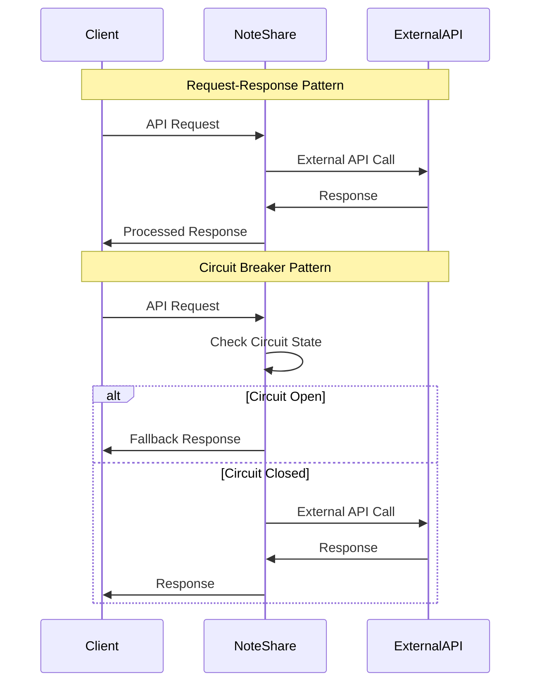
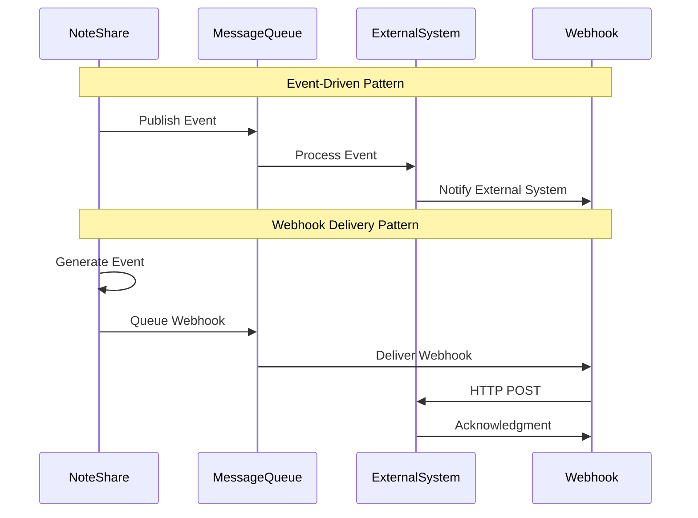
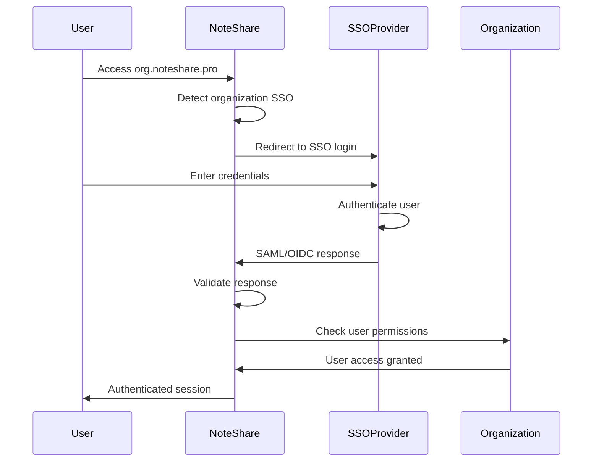
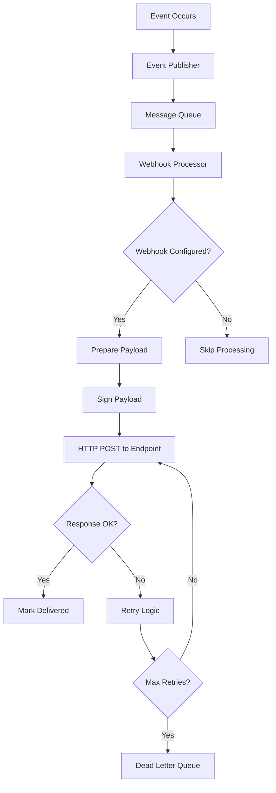

# Integration Architecture Overview

**Phase**: 03 - Technical Discovery & Architecture (aka: Solution Architecture, Systems Design, Tech Blueprint, Foundations Sprint)  
**Deliverable Type**: Integration Strategy & Design  
**Template Purpose**: Define integration patterns, external system connections, and API strategy for the SaaS platform  
**Last Updated**: November 2024

## Overview

*This document defines the integration architecture for NoteShare Pro, covering how the platform connects with external systems, third-party services, and customer environments. The architecture supports various integration patterns while maintaining security, reliability, and scalability.*

Integration architecture encompasses:
- **External System Integrations**: SSO providers, email services, storage systems
- **API Strategy**: REST APIs, WebSocket APIs, webhook delivery
- **Data Exchange Patterns**: Real-time sync, batch processing, event-driven updates
- **Security & Authentication**: OAuth flows, API keys, secure communication

## Integration Patterns & Principles

*Define the architectural patterns and principles governing system integrations.*

### Integration Principles
```javascript
const integrationPrinciples = {
  'loose_coupling': {
    description: 'Minimize dependencies between systems',
    implementation: [
      'Event-driven architecture',
      'API-first design',
      'Circuit breaker patterns',
      'Graceful degradation'
    ]
  },
  
  'security_first': {
    description: 'Security controls in all integration points',
    implementation: [
      'OAuth 2.0 / OIDC for authentication',
      'TLS 1.3 for all communications',
      'API rate limiting and throttling',
      'Input validation and sanitization'
    ]
  },
  
  'reliability': {
    description: 'Resilient integrations with fault tolerance',
    implementation: [
      'Retry mechanisms with exponential backoff',
      'Dead letter queues for failed messages',
      'Health checks and monitoring',
      'Fallback mechanisms'
    ]
  },
  
  'observability': {
    description: 'Comprehensive monitoring and tracing',
    implementation: [
      'Distributed tracing across integrations',
      'Structured logging with correlation IDs',
      'Metrics collection and alerting',
      'Integration health dashboards'
    ]
  }
};
```

### Integration Patterns

#### Synchronous Integration Patterns


#### Asynchronous Integration Patterns


## External System Integrations

*Define integrations with external systems and third-party services.*

### Identity & Authentication Integrations

#### Single Sign-On (SSO) Providers
```javascript
const ssoIntegrations = {
  'active_directory': {
    protocol: 'SAML 2.0 / OIDC',
    use_cases: ['Enterprise customer authentication', 'User provisioning'],
    configuration: {
      entity_id: 'https://noteshare.pro/saml/metadata',
      acs_url: 'https://noteshare.pro/saml/acs',
      sls_url: 'https://noteshare.pro/saml/sls',
      certificate: 'X.509 certificate for SAML signing'
    },
    user_attributes: [
      'email', 'first_name', 'last_name', 'department', 'manager'
    ],
    provisioning: 'JIT (Just-In-Time) user creation'
  },
  
  'okta': {
    protocol: 'OIDC / OAuth 2.0',
    use_cases: ['Enterprise authentication', 'API access'],
    configuration: {
      client_id: 'okta_client_id',
      client_secret: 'okta_client_secret',
      issuer: 'https://customer.okta.com',
      scopes: ['openid', 'profile', 'email', 'groups']
    },
    user_attributes: [
      'sub', 'email', 'given_name', 'family_name', 'groups'
    ],
    provisioning: 'SCIM 2.0 for user lifecycle management'
  },
  
  'auth0': {
    protocol: 'OIDC / OAuth 2.0',
    use_cases: ['SMB authentication', 'Social login'],
    configuration: {
      domain: 'customer.auth0.com',
      client_id: 'auth0_client_id',
      client_secret: 'auth0_client_secret',
      audience: 'https://api.noteshare.pro'
    },
    features: [
      'Social login (Google, Microsoft, GitHub)',
      'Multi-factor authentication',
      'Passwordless authentication'
    ]
  }
};
```

#### SSO Integration Flow


### Communication & Notification Integrations

#### Email Service Providers
```javascript
const emailIntegrations = {
  'sendgrid': {
    use_cases: ['Transactional emails', 'Notifications', 'Marketing'],
    api_endpoint: 'https://api.sendgrid.com/v3',
    authentication: 'API Key',
    features: [
      'Template management',
      'Delivery analytics',
      'Bounce handling',
      'Unsubscribe management'
    ],
    email_types: {
      'welcome': 'User onboarding emails',
      'notification': 'Note sharing and collaboration alerts',
      'security': 'Login alerts and security notifications',
      'digest': 'Daily/weekly activity summaries'
    }
  },
  
  'aws_ses': {
    use_cases: ['High-volume transactional emails', 'Cost optimization'],
    api_endpoint: 'https://email.{region}.amazonaws.com',
    authentication: 'AWS IAM credentials',
    features: [
      'High deliverability',
      'Cost-effective for volume',
      'Bounce and complaint handling',
      'Configuration sets'
    ]
  }
};
```

#### Slack Integration
```javascript
const slackIntegration = {
  integration_type: 'Slack App',
  oauth_scopes: [
    'channels:read', 'chat:write', 'files:write', 'users:read'
  ],
  
  features: {
    'note_sharing': {
      description: 'Share notes directly to Slack channels',
      implementation: 'Slack slash command + interactive messages',
      workflow: [
        'User types /noteshare [note-id] in Slack',
        'NoteShare bot responds with note preview',
        'User selects sharing options',
        'Note link posted to channel'
      ]
    },
    
    'notifications': {
      description: 'Receive NoteShare notifications in Slack',
      implementation: 'Incoming webhooks',
      triggers: [
        'Note shared with user',
        'Comment added to subscribed note',
        'Mention in note or comment'
      ]
    },
    
    'note_creation': {
      description: 'Create notes from Slack messages',
      implementation: 'Message actions + modal dialogs',
      workflow: [
        'User clicks "Create Note" on Slack message',
        'Modal opens with message content',
        'User adds title and selects folder',
        'Note created in NoteShare'
      ]
    }
  }
};
```

### File Storage & Content Integrations

#### Cloud Storage Providers
```javascript
const storageIntegrations = {
  'aws_s3': {
    primary_use: 'Default file storage',
    features: [
      'Scalable object storage',
      'Lifecycle policies',
      'Cross-region replication',
      'Server-side encryption'
    ],
    configuration: {
      bucket_naming: 'noteshare-{environment}-{region}-attachments',
      encryption: 'AES-256 with KMS',
      lifecycle: 'Move to IA after 30 days, Glacier after 90 days'
    }
  },
  
  'google_drive': {
    primary_use: 'Customer file import/export',
    integration_type: 'OAuth 2.0 API',
    scopes: ['drive.file', 'drive.readonly'],
    features: [
      'Import documents from Google Drive',
      'Export notes to Google Drive',
      'Real-time collaboration sync'
    ],
    supported_formats: [
      'Google Docs → Markdown conversion',
      'Google Sheets → CSV export',
      'PDF files → attachment storage'
    ]
  },
  
  'microsoft_onedrive': {
    primary_use: 'Enterprise file integration',
    integration_type: 'Microsoft Graph API',
    scopes: ['Files.ReadWrite', 'Sites.ReadWrite.All'],
    features: [
      'SharePoint document import',
      'OneDrive file synchronization',
      'Office 365 integration'
    ]
  }
};
```

### Analytics & Monitoring Integrations

#### Analytics Platforms
```javascript
const analyticsIntegrations = {
  'google_analytics': {
    implementation: 'GA4 with gtag',
    tracking_scope: 'Public pages and authenticated user actions',
    events: [
      'user_signup', 'note_created', 'note_shared', 'collaboration_started'
    ],
    custom_dimensions: [
      'organization_plan', 'user_role', 'feature_usage'
    ]
  },
  
  'mixpanel': {
    implementation: 'JavaScript SDK + Server-side API',
    tracking_scope: 'Detailed user behavior and feature usage',
    events: [
      'feature_adoption', 'user_retention', 'collaboration_patterns'
    ],
    cohort_analysis: 'User retention and feature adoption tracking'
  },
  
  'amplitude': {
    implementation: 'Client and server-side SDKs',
    tracking_scope: 'Product analytics and user journey',
    features: [
      'Funnel analysis',
      'User path analysis',
      'Behavioral cohorts',
      'A/B testing integration'
    ]
  }
};
```

## API Strategy & Design

*Define the API strategy for external integrations and customer access.*

### REST API Architecture

#### API Versioning Strategy
```javascript
const apiVersioning = {
  strategy: 'URL path versioning',
  format: 'https://api.noteshare.pro/v{major}',
  
  version_lifecycle: {
    'v1': {
      status: 'current',
      release_date: '2024-01-01',
      deprecation_date: null,
      sunset_date: null
    },
    'v2': {
      status: 'development',
      release_date: '2024-06-01',
      deprecation_date: null,
      sunset_date: null
    }
  },
  
  compatibility_policy: {
    'backward_compatibility': '12 months minimum',
    'deprecation_notice': '6 months before sunset',
    'breaking_changes': 'Major version increment only'
  }
};
```

#### API Gateway Configuration
```yaml
api_gateway:
  rate_limiting:
    authenticated_users: "1000 requests/hour"
    api_key_users: "10000 requests/hour"
    unauthenticated: "100 requests/hour"
  
  security:
    authentication:
      - JWT Bearer tokens
      - API keys
      - OAuth 2.0
    
    cors:
      allowed_origins: ["https://*.noteshare.pro", "https://localhost:3000"]
      allowed_methods: ["GET", "POST", "PUT", "DELETE", "PATCH"]
      allowed_headers: ["Authorization", "Content-Type", "X-API-Key"]
  
  monitoring:
    metrics: ["request_count", "response_time", "error_rate"]
    logging: "structured JSON with correlation IDs"
    tracing: "distributed tracing with Jaeger"
```

### WebSocket API for Real-time Features

#### Real-time Integration Architecture
```javascript
const websocketIntegrations = {
  'collaborative_editing': {
    namespace: '/collaboration',
    authentication: 'JWT token in connection handshake',
    events: {
      'join_document': 'User joins collaborative editing session',
      'edit_operation': 'Real-time text editing operation',
      'cursor_position': 'User cursor position update',
      'user_presence': 'User online/offline status'
    },
    scaling: 'Redis adapter for multi-instance scaling'
  },
  
  'notifications': {
    namespace: '/notifications',
    authentication: 'User session validation',
    events: {
      'note_shared': 'Note shared with user',
      'comment_added': 'New comment on subscribed note',
      'mention_received': 'User mentioned in note or comment'
    },
    delivery_guarantee: 'At-least-once with client acknowledgment'
  }
};
```

### Webhook Delivery System

#### Webhook Architecture


#### Webhook Configuration
```javascript
const webhookSystem = {
  supported_events: [
    'note.created', 'note.updated', 'note.deleted',
    'note.shared', 'note.unshared',
    'comment.created', 'comment.updated',
    'user.created', 'user.updated'
  ],
  
  delivery_configuration: {
    timeout: '30 seconds',
    retry_policy: {
      max_attempts: 5,
      backoff_strategy: 'exponential',
      initial_delay: '1 second',
      max_delay: '300 seconds'
    },
    signature: {
      algorithm: 'HMAC-SHA256',
      header: 'X-NoteShare-Signature',
      secret: 'customer_webhook_secret'
    }
  },
  
  payload_format: {
    event_type: 'note.created',
    timestamp: '2024-11-06T10:30:00Z',
    organization_id: 'uuid',
    data: {
      // Event-specific payload
    },
    webhook_id: 'uuid',
    delivery_attempt: 1
  }
};
```

## Integration Security

*Security measures and controls for all integrations.*

### Authentication & Authorization

#### OAuth 2.0 Implementation
```javascript
const oauthImplementation = {
  authorization_server: 'https://auth.noteshare.pro',
  
  supported_flows: {
    'authorization_code': {
      use_case: 'Web applications, mobile apps',
      pkce_required: true,
      scopes: ['read', 'write', 'admin']
    },
    
    'client_credentials': {
      use_case: 'Server-to-server integrations',
      scopes: ['api.read', 'api.write', 'webhooks.manage']
    }
  },
  
  token_configuration: {
    access_token_ttl: '1 hour',
    refresh_token_ttl: '30 days',
    token_format: 'JWT with RS256 signing',
    token_introspection: 'RFC 7662 compliant'
  }
};
```

#### API Security Controls
```javascript
const apiSecurity = {
  'input_validation': {
    'request_size_limits': '10MB for file uploads, 1MB for JSON',
    'content_type_validation': 'Strict content-type checking',
    'schema_validation': 'JSON Schema validation for all endpoints',
    'sql_injection_prevention': 'Parameterized queries only'
  },
  
  'rate_limiting': {
    'algorithm': 'Token bucket with Redis backend',
    'limits_by_tier': {
      'free': '100 requests/hour',
      'pro': '1000 requests/hour',
      'enterprise': '10000 requests/hour'
    },
    'burst_allowance': '10x normal rate for 1 minute'
  },
  
  'encryption': {
    'tls_version': 'TLS 1.3 minimum',
    'cipher_suites': 'AEAD ciphers only',
    'certificate_pinning': 'HPKP headers for critical endpoints',
    'payload_encryption': 'End-to-end encryption for sensitive data'
  }
};
```

### Data Privacy in Integrations

#### Privacy Controls
```javascript
const integrationPrivacy = {
  'data_minimization': {
    'principle': 'Only share necessary data with external systems',
    'implementation': [
      'Field-level permissions in API responses',
      'Configurable data sharing policies',
      'Automatic PII detection and masking'
    ]
  },
  
  'consent_management': {
    'granular_consent': 'Per-integration consent tracking',
    'consent_withdrawal': 'Real-time integration disabling',
    'audit_trail': 'Complete consent history logging'
  },
  
  'cross_border_transfers': {
    'data_residency': 'Respect customer data residency requirements',
    'transfer_safeguards': 'Standard Contractual Clauses for EU data',
    'encryption_in_transit': 'End-to-end encryption for international transfers'
  }
};
```

## Integration Monitoring & Observability

*Monitoring, logging, and observability for all integrations.*

### Integration Health Monitoring

#### Health Check Framework
```javascript
const healthChecks = {
  'external_services': {
    'sso_providers': {
      check_type: 'OIDC discovery endpoint',
      frequency: '60 seconds',
      timeout: '10 seconds',
      failure_threshold: 3
    },
    
    'email_service': {
      check_type: 'API health endpoint',
      frequency: '30 seconds',
      timeout: '5 seconds',
      failure_threshold: 2
    },
    
    'storage_service': {
      check_type: 'List bucket operation',
      frequency: '120 seconds',
      timeout: '15 seconds',
      failure_threshold: 3
    }
  },
  
  'integration_endpoints': {
    'webhook_delivery': {
      metric: 'Successful delivery rate',
      threshold: '95% success rate',
      window: '5 minutes'
    },
    
    'api_response_time': {
      metric: 'P95 response time',
      threshold: '500ms',
      window: '1 minute'
    }
  }
};
```

#### Integration Metrics Dashboard
```javascript
const integrationMetrics = {
  'api_metrics': {
    'request_volume': 'Requests per second by endpoint',
    'response_time': 'P50, P95, P99 response times',
    'error_rate': 'Error rate by status code',
    'rate_limit_hits': 'Rate limiting trigger frequency'
  },
  
  'webhook_metrics': {
    'delivery_success_rate': 'Successful webhook deliveries',
    'retry_rate': 'Webhook retry frequency',
    'average_delivery_time': 'Time from event to delivery',
    'dead_letter_queue_size': 'Failed webhook count'
  },
  
  'integration_health': {
    'service_availability': 'External service uptime',
    'authentication_success_rate': 'SSO authentication success',
    'data_sync_lag': 'Time lag for data synchronization'
  }
};
```

## Integration Testing Strategy

*Testing approaches for integration reliability and security.*

### Integration Test Types

#### Contract Testing
```javascript
const contractTesting = {
  'api_contracts': {
    tool: 'Pact or OpenAPI Contract Testing',
    scope: 'API consumer-provider contracts',
    automation: 'CI/CD pipeline integration',
    coverage: 'All external API integrations'
  },
  
  'webhook_contracts': {
    tool: 'Custom webhook testing framework',
    scope: 'Webhook payload schemas and delivery',
    automation: 'Automated webhook endpoint testing',
    validation: 'Payload schema and signature verification'
  }
};
```

#### End-to-End Integration Testing
```javascript
const e2eIntegrationTests = {
  'sso_flow_testing': {
    scenarios: [
      'Successful SSO login flow',
      'SSO provider unavailable',
      'Invalid SAML response handling',
      'User provisioning and deprovisioning'
    ],
    environment: 'Staging with test SSO provider'
  },
  
  'webhook_delivery_testing': {
    scenarios: [
      'Successful webhook delivery',
      'Webhook endpoint unavailable',
      'Retry mechanism validation',
      'Signature verification'
    ],
    tools: 'Mock webhook endpoints and delivery simulation'
  }
};
```

---

*This integration architecture overview provides a comprehensive framework for connecting NoteShare Pro with external systems and services. Use this template to design your own integration strategy by adapting the patterns, security controls, and monitoring approaches to match your specific integration requirements and external system landscape.*