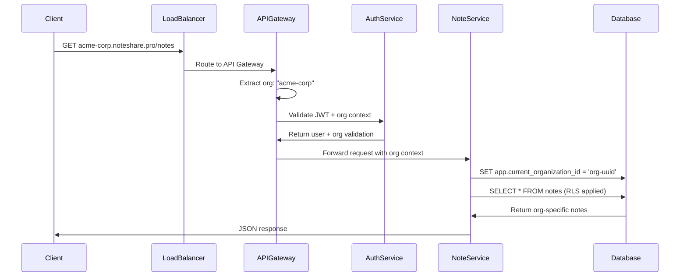
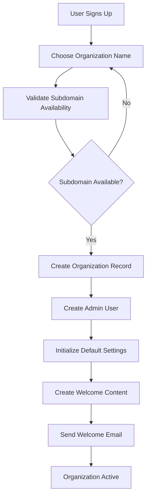

# Multi-Tenancy Model Specification

**Phase**: 03 - Technical Discovery & Architecture (aka: Solution Architecture, Systems Design, Tech Blueprint, Foundations Sprint)  
**Deliverable Type**: Multi-Tenant Architecture Design  
**Template Purpose**: Define the multi-tenancy strategy, data isolation, and tenant management for the SaaS platform  
**Last Updated**: November 2024

## Overview

*This document defines the multi-tenancy model for NoteShare Pro, specifying how multiple organizations (tenants) share the same application infrastructure while maintaining complete data isolation and security. The design balances cost efficiency with security, performance, and customization requirements.*

Multi-tenancy is a software architecture pattern where a single instance of software serves multiple tenants (customers/organizations). Each tenant's data is isolated and remains invisible to other tenants, while sharing the same application infrastructure.

## Tenancy Architecture Pattern

*Define the overall multi-tenancy approach and architectural decisions.*

### Chosen Pattern: Shared Database, Shared Schema
NoteShare Pro implements a **shared database, shared schema** multi-tenancy pattern with organization-based data partitioning.

**Rationale:**
- **Cost Efficiency**: Maximum resource sharing reduces infrastructure costs
- **Operational Simplicity**: Single database instance to maintain and backup
- **Scalability**: Efficient resource utilization across all tenants
- **Feature Parity**: All tenants get identical functionality and updates simultaneously

### Alternative Patterns Considered

#### Separate Databases per Tenant
```
✗ Rejected due to:
- High operational overhead (thousands of databases)
- Increased infrastructure costs
- Complex backup and maintenance procedures
- Difficult cross-tenant analytics and reporting
```

#### Shared Database, Separate Schemas
```
✗ Rejected due to:
- Database connection pool limitations
- Complex schema migration management
- Limited scalability with large tenant counts
- Increased query complexity
```

## Data Isolation Strategy

*Define how tenant data is isolated and secured within the shared infrastructure.*

### Organization-Based Partitioning
All data tables include an `organization_id` column that serves as the tenant identifier:

```sql
-- Example table structure with tenant isolation
CREATE TABLE notes (
    id UUID PRIMARY KEY,
    organization_id UUID NOT NULL,  -- Tenant isolation key
    title VARCHAR(500) NOT NULL,
    content TEXT,
    author_id UUID NOT NULL,
    created_at TIMESTAMP DEFAULT NOW(),
    
    -- Foreign key ensures user belongs to same organization
    FOREIGN KEY (author_id) REFERENCES users(id),
    FOREIGN KEY (organization_id) REFERENCES organizations(id)
);

-- Row Level Security policy
CREATE POLICY tenant_isolation ON notes
    FOR ALL TO application_role
    USING (organization_id = current_setting('app.current_organization_id')::UUID);
```

### Row-Level Security (RLS)
PostgreSQL Row-Level Security enforces tenant isolation at the database level:

```sql
-- Enable RLS on all tenant tables
ALTER TABLE notes ENABLE ROW LEVEL SECURITY;
ALTER TABLE users ENABLE ROW LEVEL SECURITY;
ALTER TABLE folders ENABLE ROW LEVEL SECURITY;

-- Create policies for tenant isolation
CREATE POLICY tenant_notes_policy ON notes
    FOR ALL TO application_role
    USING (organization_id = current_setting('app.current_organization_id')::UUID);

-- Application sets organization context per connection
SET app.current_organization_id = 'tenant-uuid-here';
```

### Application-Level Isolation
Multiple layers of isolation ensure data security:

1. **Authentication Layer**: JWT tokens include organization_id claim
2. **API Gateway**: Validates organization context for all requests
3. **Service Layer**: All queries automatically include organization_id filter
4. **Database Layer**: Row-Level Security provides final enforcement

## Tenant Identification & Routing

*Define how tenants are identified and requests are routed to appropriate data.*

### Tenant Identification Methods

#### Primary: Subdomain-Based Routing
```
https://acme-corp.noteshare.pro/dashboard
https://tech-startup.noteshare.pro/notes/123
```

**Implementation:**
```javascript
// Extract organization from subdomain
const extractOrganization = (req) => {
  const subdomain = req.hostname.split('.')[0];
  if (subdomain === 'www' || subdomain === 'api') {
    return null; // Main site or API
  }
  return subdomain;
};

// Middleware to set organization context
const setOrganizationContext = async (req, res, next) => {
  const orgSlug = extractOrganization(req);
  if (orgSlug) {
    const org = await Organization.findBySlug(orgSlug);
    req.organization = org;
    req.organizationId = org.id;
  }
  next();
};
```

#### Secondary: Custom Domain Support
```
https://notes.acme-corp.com/dashboard
https://docs.tech-startup.io/notes/123
```

**Implementation:**
```javascript
// Custom domain mapping
const customDomainMap = {
  'notes.acme-corp.com': 'acme-corp-org-id',
  'docs.tech-startup.io': 'tech-startup-org-id'
};

const resolveOrganizationFromDomain = (hostname) => {
  return customDomainMap[hostname] || null;
};
```

#### Fallback: Path-Based Routing
```
https://app.noteshare.pro/org/acme-corp/dashboard
https://app.noteshare.pro/org/tech-startup/notes/123
```

### Request Flow


## Tenant Onboarding & Provisioning

*Define the process for creating new tenants and provisioning resources.*

### Organization Registration Flow


### Provisioning Process
```javascript
const provisionNewOrganization = async (registrationData) => {
  const transaction = await db.beginTransaction();
  
  try {
    // 1. Create organization
    const organization = await Organization.create({
      name: registrationData.organizationName,
      slug: registrationData.subdomain,
      domain: registrationData.domain,
      plan: 'starter',
      settings: getDefaultSettings('starter')
    }, { transaction });

    // 2. Create admin user
    const adminUser = await User.create({
      organization_id: organization.id,
      email: registrationData.email,
      first_name: registrationData.firstName,
      last_name: registrationData.lastName,
      role: 'admin',
      password_hash: await hashPassword(registrationData.password)
    }, { transaction });

    // 3. Create default folder structure
    await createDefaultFolders(organization.id, adminUser.id, transaction);

    // 4. Create welcome content
    await createWelcomeContent(organization.id, adminUser.id, transaction);

    // 5. Initialize organization settings
    await initializeOrganizationSettings(organization.id, transaction);

    await transaction.commit();
    
    // 6. Send welcome email
    await sendWelcomeEmail(adminUser.email, organization);
    
    return { organization, adminUser };
  } catch (error) {
    await transaction.rollback();
    throw error;
  }
};
```

## Tenant Configuration & Customization

*Define how tenants can customize their experience within the shared platform.*

### Organization Settings Model
```javascript
const organizationSettings = {
  // Branding customization
  branding: {
    logo_url: 'https://cdn.example.com/logos/org-123.png',
    primary_color: '#1a73e8',
    secondary_color: '#34a853',
    custom_css_url: 'https://cdn.example.com/css/org-123.css'
  },
  
  // Feature toggles
  features: {
    public_sharing: true,
    guest_access: false,
    advanced_search: true,
    api_access: true,
    webhooks: false,
    sso_integration: true
  },
  
  // Security settings
  security: {
    require_2fa: false,
    password_policy: 'standard', // standard, strict, custom
    session_timeout_minutes: 480,
    ip_whitelist: [],
    allowed_domains: ['@acme-corp.com']
  },
  
  // Limits and quotas
  limits: {
    max_users: 100,
    max_storage_gb: 50,
    max_file_size_mb: 25,
    api_rate_limit: 1000
  },
  
  // Integration settings
  integrations: {
    sso_provider: 'okta',
    sso_config: { /* SSO configuration */ },
    webhook_endpoints: [],
    email_domain: 'acme-corp.com'
  }
};
```

### Plan-Based Feature Matrix
```javascript
const planFeatures = {
  starter: {
    max_users: 25,
    max_storage_gb: 10,
    features: ['basic_notes', 'basic_sharing', 'basic_search'],
    integrations: ['email_notifications'],
    support_level: 'community'
  },
  
  professional: {
    max_users: 500,
    max_storage_gb: 100,
    features: ['advanced_notes', 'advanced_sharing', 'advanced_search', 'version_history'],
    integrations: ['sso', 'webhooks', 'api_access'],
    support_level: 'email'
  },
  
  enterprise: {
    max_users: 10000,
    max_storage_gb: 1000,
    features: ['all_features'],
    integrations: ['all_integrations', 'custom_domain', 'white_label'],
    support_level: 'priority'
  }
};
```

## Data Partitioning Strategy

*Define how data is partitioned and distributed across the infrastructure.*

### Logical Partitioning
All tables use `organization_id` as the partition key:

```sql
-- Partition large tables by organization_id hash
CREATE TABLE activity_logs (
    id UUID,
    organization_id UUID NOT NULL,
    user_id UUID,
    action VARCHAR(100),
    created_at TIMESTAMP DEFAULT NOW()
) PARTITION BY HASH (organization_id);

-- Create partitions for better performance
CREATE TABLE activity_logs_p0 PARTITION OF activity_logs
    FOR VALUES WITH (MODULUS 4, REMAINDER 0);
CREATE TABLE activity_logs_p1 PARTITION OF activity_logs
    FOR VALUES WITH (MODULUS 4, REMAINDER 1);
-- ... additional partitions
```

### Indexing Strategy
```sql
-- Composite indexes with organization_id first
CREATE INDEX idx_notes_org_created ON notes(organization_id, created_at DESC);
CREATE INDEX idx_users_org_email ON users(organization_id, email);
CREATE INDEX idx_folders_org_parent ON folders(organization_id, parent_folder_id);

-- Partial indexes for common queries
CREATE INDEX idx_notes_org_public ON notes(organization_id, is_public) 
    WHERE is_public = true;
CREATE INDEX idx_users_org_active ON users(organization_id, is_active) 
    WHERE is_active = true;
```

## Tenant Isolation Validation

*Define testing and validation procedures to ensure tenant isolation.*

### Automated Isolation Tests
```javascript
describe('Tenant Isolation', () => {
  it('should not allow cross-tenant data access', async () => {
    // Create two organizations
    const org1 = await createTestOrganization('org1');
    const org2 = await createTestOrganization('org2');
    
    // Create notes in each organization
    const note1 = await createNote({ organization_id: org1.id, title: 'Org1 Note' });
    const note2 = await createNote({ organization_id: org2.id, title: 'Org2 Note' });
    
    // User from org1 should not see org2's notes
    const org1User = await createUser({ organization_id: org1.id });
    const org1Context = { user: org1User, organization_id: org1.id };
    
    const visibleNotes = await getNotes(org1Context);
    expect(visibleNotes).toHaveLength(1);
    expect(visibleNotes[0].id).toBe(note1.id);
    expect(visibleNotes.find(n => n.id === note2.id)).toBeUndefined();
  });
  
  it('should enforce RLS at database level', async () => {
    // Direct database query should respect RLS
    await db.query("SET app.current_organization_id = $1", [org1.id]);
    const result = await db.query("SELECT * FROM notes");
    
    // Should only return org1 notes
    expect(result.rows.every(row => row.organization_id === org1.id)).toBe(true);
  });
});
```

### Security Audit Procedures
1. **Quarterly Isolation Audits**: Automated tests verify no cross-tenant data leakage
2. **Penetration Testing**: External security testing includes tenant isolation validation
3. **Code Review**: All database queries reviewed for proper tenant filtering
4. **Monitoring**: Real-time monitoring for suspicious cross-tenant access attempts

## Performance Considerations

*Address performance implications of the multi-tenancy model.*

### Query Performance
- **Tenant-First Indexing**: All indexes include `organization_id` as the first column
- **Query Planning**: Database query planner optimized for tenant-scoped queries
- **Connection Pooling**: Separate connection pools per tenant for large organizations
- **Caching Strategy**: Cache keys include organization context

### Resource Allocation
```javascript
// Dynamic resource allocation based on tenant size
const getTenantResourceLimits = (organization) => {
  const userCount = organization.user_count;
  
  if (userCount > 5000) {
    return {
      connection_pool_size: 20,
      cache_memory_mb: 512,
      rate_limit_per_minute: 10000
    };
  } else if (userCount > 1000) {
    return {
      connection_pool_size: 10,
      cache_memory_mb: 256,
      rate_limit_per_minute: 5000
    };
  } else {
    return {
      connection_pool_size: 5,
      cache_memory_mb: 128,
      rate_limit_per_minute: 1000
    };
  }
};
```

## Tenant Migration & Backup

*Define procedures for tenant data migration and backup strategies.*

### Tenant Data Export
```javascript
const exportTenantData = async (organizationId) => {
  const exportData = {
    organization: await Organization.findById(organizationId),
    users: await User.findByOrganization(organizationId),
    notes: await Note.findByOrganization(organizationId),
    folders: await Folder.findByOrganization(organizationId),
    attachments: await Attachment.findByOrganization(organizationId)
  };
  
  // Create encrypted export file
  const exportFile = await createEncryptedExport(exportData);
  return exportFile;
};
```

### Tenant-Specific Backups
```sql
-- Create tenant-specific backup
pg_dump --host=localhost --port=5432 --username=backup_user \
  --format=custom --compress=9 --verbose \
  --where="organization_id = 'tenant-uuid'" \
  --table=notes --table=users --table=folders \
  noteshare_db > tenant_backup.dump
```

### Disaster Recovery
- **Point-in-Time Recovery**: Restore specific tenant data to any point in time
- **Selective Restore**: Restore individual tenant without affecting others
- **Cross-Region Replication**: Tenant data replicated to disaster recovery region

## Monitoring & Analytics

*Define tenant-specific monitoring and analytics capabilities.*

### Tenant Metrics
```javascript
const tenantMetrics = {
  usage: {
    active_users_daily: 150,
    notes_created_daily: 45,
    storage_used_gb: 12.5,
    api_calls_daily: 2500
  },
  
  performance: {
    avg_response_time_ms: 180,
    error_rate_percent: 0.02,
    uptime_percent: 99.98
  },
  
  limits: {
    user_limit_utilization: 0.6,  // 60% of user limit used
    storage_limit_utilization: 0.25,  // 25% of storage limit used
    api_limit_utilization: 0.4   // 40% of API limit used
  }
};
```

### Cross-Tenant Analytics
- **Resource Utilization**: Track resource usage across all tenants
- **Performance Benchmarks**: Compare tenant performance metrics
- **Capacity Planning**: Predict infrastructure needs based on tenant growth
- **Cost Allocation**: Allocate infrastructure costs per tenant

---

*This multi-tenancy model provides secure, scalable, and cost-effective tenant isolation for NoteShare Pro. Use this template to design your own multi-tenant architecture by adapting the isolation strategy, tenant identification, and resource allocation approaches to match your specific requirements and constraints.*