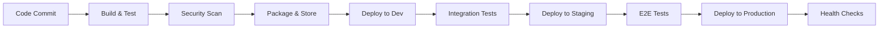

# CI/CD Pipeline Specification

**Phase**: 5 - Platform & Developer Experience (aka: DevOps Foundations, Paved Road, Golden Path, Platform Engineering)  
**Deliverable Type**: Technical Infrastructure Documentation  
**Template Purpose**: Define automated deployment pipeline architecture and processes for consistent, reliable software delivery  
**Last Updated**: November 2025

## Executive Summary

*This document outlines the continuous integration and continuous deployment (CI/CD) pipeline architecture for NoteShare Pro, ensuring automated, secure, and reliable software delivery from code commit to production deployment. The pipeline supports multiple environments, automated testing, security scanning, and rollback capabilities.*

### Pipeline Overview for NoteShare Pro

Our CI/CD pipeline enables rapid, safe deployment of the NoteShare Pro SaaS platform across development, staging, and production environments. The pipeline processes approximately 50+ deployments per week across our microservices architecture, supporting our team of 15 engineers with automated quality gates and deployment strategies.

## Template Guidance

*Use this section to describe your specific CI/CD pipeline architecture, including the tools, stages, and processes that support your development workflow. Include both technical specifications and operational procedures.*

## Pipeline Architecture

### High-Level Pipeline Flow

### Pipeline Stages

#### 1. Source Control Integration
- **Trigger**: Git push to main branch or pull request
- **Repository**: GitHub Enterprise with branch protection rules
- **Branching Strategy**: GitFlow with feature branches and release branches
- **Code Review**: Mandatory peer review with at least 2 approvals

#### 2. Build Stage
- **Build Tool**: Docker multi-stage builds
- **Artifact Generation**: Container images for each microservice
- **Build Time**: Target <5 minutes for typical changes
- **Caching Strategy**: Layer caching and dependency caching enabled

#### 3. Automated Testing
- **Unit Tests**: Jest for frontend, JUnit for backend services
- **Coverage Requirement**: Minimum 80% code coverage
- **Integration Tests**: API contract testing with Pact
- **Performance Tests**: Load testing with k6 for critical paths

#### 4. Security & Quality Gates
- **SAST**: SonarQube static analysis with quality gates
- **Dependency Scanning**: Snyk for vulnerability detection
- **Container Scanning**: Trivy for image security analysis
- **License Compliance**: FOSSA for open source license validation

#### 5. Deployment Automation
- **Infrastructure**: Kubernetes on AWS EKS
- **Deployment Strategy**: Blue-green deployments for zero downtime
- **Configuration Management**: Helm charts with environment-specific values
- **Secret Management**: AWS Secrets Manager integration

## Template Guidance - Pipeline Stages

*Define each stage of your pipeline with specific tools, success criteria, and failure handling. Include timing expectations and quality gates that must be passed before proceeding to the next stage.*

## Environment Strategy

### Development Environment
- **Purpose**: Feature development and initial testing
- **Deployment**: Automatic on feature branch merge
- **Data**: Synthetic test data, refreshed weekly
- **Access**: All engineering team members
- **Retention**: 7 days for feature branches

### Staging Environment
- **Purpose**: Pre-production validation and user acceptance testing
- **Deployment**: Manual approval required after dev validation
- **Data**: Production-like dataset (anonymized)
- **Access**: Engineering, QA, and product teams
- **Testing**: Full regression suite and performance testing

### Production Environment
- **Purpose**: Live customer-facing application
- **Deployment**: Automated with manual approval gates
- **Monitoring**: Full observability stack with alerting
- **Rollback**: Automated rollback on health check failures
- **Maintenance Windows**: Scheduled during low-traffic periods

## Template Guidance - Environments

*Document your environment strategy including the purpose of each environment, deployment triggers, data management, access controls, and promotion criteria between environments.*

## Deployment Strategies

### Blue-Green Deployment
- **Implementation**: Kubernetes deployments with service switching
- **Benefits**: Zero-downtime deployments and instant rollback capability
- **Health Checks**: Application readiness and liveness probes
- **Traffic Switching**: Gradual traffic migration over 10-minute window

### Feature Flags Integration
- **Tool**: LaunchDarkly for feature flag management
- **Strategy**: Dark launches for new features with gradual rollout
- **Rollback**: Instant feature disable without code deployment
- **Monitoring**: Feature flag performance and adoption metrics

### Database Migrations
- **Strategy**: Backward-compatible migrations with separate deployment
- **Validation**: Migration testing in staging environment
- **Rollback Plan**: Database backup before migration execution
- **Monitoring**: Migration performance and data integrity checks

## Security Integration

### Pipeline Security
- **Access Control**: Role-based access with MFA requirements
- **Secrets Management**: No secrets in code, all externalized
- **Audit Logging**: Complete pipeline execution audit trail
- **Compliance**: SOC 2 Type II compliance requirements

### Deployment Security
- **Image Signing**: Container image signing with Cosign
- **Runtime Security**: Falco for runtime threat detection
- **Network Policies**: Kubernetes network policies for micro-segmentation
- **Vulnerability Management**: Automated patching for critical vulnerabilities

## Template Guidance - Security

*Detail the security measures integrated into your CI/CD pipeline, including access controls, secret management, vulnerability scanning, and compliance requirements.*

## Monitoring & Observability

### Pipeline Metrics
- **Build Success Rate**: Target >95% success rate
- **Deployment Frequency**: Current average 7 deployments/day
- **Lead Time**: Code commit to production <2 hours
- **Mean Time to Recovery**: Target <30 minutes for rollbacks

### Application Monitoring
- **APM**: Datadog for application performance monitoring
- **Logging**: Centralized logging with ELK stack
- **Metrics**: Prometheus and Grafana for infrastructure metrics
- **Alerting**: PagerDuty integration for critical alerts

### Dashboard & Reporting
- **Pipeline Dashboard**: Real-time build and deployment status
- **DORA Metrics**: Automated tracking of DevOps performance metrics
- **Incident Correlation**: Link deployments to incident timeline
- **Capacity Planning**: Resource utilization and scaling metrics

## Disaster Recovery & Business Continuity

### Backup Strategy
- **Code Repository**: Multi-region GitHub Enterprise backup
- **Artifacts**: Container registry replication across regions
- **Configuration**: Infrastructure as Code stored in version control
- **Secrets**: Cross-region secret replication with encryption

### Recovery Procedures
- **RTO Target**: 4 hours for full service restoration
- **RPO Target**: 1 hour maximum data loss
- **Failover Process**: Automated DNS failover to secondary region
- **Communication Plan**: Stakeholder notification and status updates

## Template Guidance - Disaster Recovery

*Define your backup and recovery procedures for both the CI/CD infrastructure and the applications it deploys. Include recovery time objectives and testing procedures.*

## Pipeline Maintenance & Evolution

### Regular Maintenance
- **Dependency Updates**: Monthly security patch cycles
- **Tool Upgrades**: Quarterly evaluation and upgrade cycle
- **Performance Optimization**: Continuous pipeline performance tuning
- **Capacity Planning**: Monthly resource utilization review

### Continuous Improvement
- **Metrics Review**: Weekly pipeline performance analysis
- **Feedback Integration**: Developer experience surveys and improvements
- **Technology Evaluation**: Quarterly assessment of new tools and practices
- **Training Program**: Monthly DevOps best practices training

### Change Management
- **Pipeline Changes**: Peer review and testing in non-production
- **Tool Evaluation**: Proof of concept before production adoption
- **Rollback Plans**: Documented procedures for pipeline changes
- **Communication**: Team notification for significant changes

## Implementation Checklist

### Phase 1: Foundation Setup
- [ ] Set up source control integration and webhooks
- [ ] Configure build environments and container registry
- [ ] Implement basic CI pipeline with unit testing
- [ ] Set up development environment deployment

### Phase 2: Quality & Security Integration
- [ ] Integrate security scanning and quality gates
- [ ] Implement automated testing suite
- [ ] Configure staging environment deployment
- [ ] Set up monitoring and alerting

### Phase 3: Production Readiness
- [ ] Implement production deployment pipeline
- [ ] Configure blue-green deployment strategy
- [ ] Set up disaster recovery procedures
- [ ] Complete security and compliance validation

### Phase 4: Optimization & Scaling
- [ ] Implement advanced deployment strategies
- [ ] Optimize pipeline performance and reliability
- [ ] Set up comprehensive monitoring and metrics
- [ ] Establish continuous improvement processes

## Template Guidance - Implementation

*Provide a phased approach to implementing your CI/CD pipeline, with specific milestones and success criteria for each phase. Include dependencies and resource requirements.*

---

*This CI/CD Pipeline Specification serves as the foundation for automated software delivery at NoteShare Pro. Regular updates ensure the pipeline evolves with our technology stack and business requirements while maintaining security, reliability, and developer productivity.*