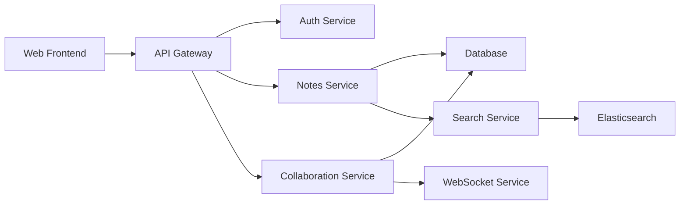

# Observability Strategy

**Phase**: 5 - Platform & Developer Experience (aka: DevOps Foundations, Paved Road, Golden Path, Platform Engineering)  
**Deliverable Type**: Monitoring & Observability Documentation  
**Template Purpose**: Define comprehensive observability approach including monitoring, logging, tracing, and alerting across all systems  
**Last Updated**: November 2025

## Executive Summary

*This document outlines the observability strategy for NoteShare Pro, providing comprehensive visibility into system health, performance, and user experience across our SaaS platform. The strategy encompasses the three pillars of observability: metrics, logs, and traces, with integrated alerting and incident response capabilities.*

### Observability Overview for NoteShare Pro

Our observability implementation provides end-to-end visibility across 15+ microservices, processing 10M+ requests daily with sub-second query performance. The strategy includes real-time monitoring, distributed tracing, centralized logging, and proactive alerting to ensure 99.9% uptime and optimal user experience.

## Template Guidance

*Use this section to define your comprehensive observability approach. Include the tools, processes, and practices that provide visibility into your systems' health, performance, and behavior.*

## Observability Architecture

### Three Pillars of Observability

#### Metrics
- **Purpose**: Quantitative measurements of system behavior over time
- **Tools**: Prometheus for collection, Grafana for visualization
- **Scope**: Infrastructure, application, and business metrics
- **Retention**: 15 days high-resolution, 1 year aggregated data

#### Logs
- **Purpose**: Discrete events and detailed system behavior records
- **Tools**: ELK Stack (Elasticsearch, Logstash, Kibana) with Fluentd
- **Scope**: Application logs, infrastructure logs, audit logs
- **Retention**: 90 days for production, 30 days for non-production

#### Traces
- **Purpose**: Request flow tracking across distributed systems
- **Tools**: Jaeger for distributed tracing with OpenTelemetry
- **Scope**: End-to-end request tracing across all microservices
- **Retention**: 7 days detailed traces, 30 days sampled traces

### Observability Stack

#### Data Collection Layer
- **Prometheus**: Metrics collection with service discovery
- **Fluentd**: Log aggregation and forwarding
- **OpenTelemetry**: Distributed tracing and metrics instrumentation
- **AWS CloudWatch**: Cloud infrastructure metrics and logs

#### Data Storage Layer
- **Prometheus TSDB**: Time-series metrics storage
- **Elasticsearch**: Log storage and indexing
- **Jaeger Storage**: Trace data storage with Elasticsearch backend
- **S3**: Long-term data archival and backup

#### Visualization & Analysis Layer
- **Grafana**: Metrics dashboards and alerting
- **Kibana**: Log analysis and visualization
- **Jaeger UI**: Distributed trace analysis
- **Custom Dashboards**: Business-specific monitoring interfaces

## Template Guidance - Architecture

*Document your observability architecture including the tools, data flow, and integration points. Include the rationale for tool selection and how the three pillars work together.*

## Metrics Strategy

### Infrastructure Metrics

#### Compute Metrics
- **CPU Utilization**: Per-node and per-container CPU usage
- **Memory Usage**: Memory utilization and allocation patterns
- **Disk I/O**: Read/write operations and disk utilization
- **Network Traffic**: Ingress/egress traffic and connection metrics

#### Kubernetes Metrics
- **Cluster Health**: Node status, pod health, resource allocation
- **Resource Utilization**: CPU/memory requests vs. limits vs. usage
- **Scaling Metrics**: HPA behavior, cluster autoscaler actions
- **Storage Metrics**: PVC usage, storage class performance

#### Database Metrics
- **Connection Pool**: Active connections, pool utilization
- **Query Performance**: Query execution time, slow query analysis
- **Replication Lag**: Primary-replica synchronization metrics
- **Storage Metrics**: Database size, index usage, table statistics

### Application Metrics

#### Performance Metrics
- **Response Time**: P50, P95, P99 response time percentiles
- **Throughput**: Requests per second, transactions per minute
- **Error Rates**: HTTP error rates by status code and endpoint
- **Availability**: Service uptime and health check success rates

#### Business Metrics
- **User Activity**: Active users, session duration, feature usage
- **Document Operations**: Note creation, sharing, collaboration events
- **Subscription Metrics**: New signups, churn rate, usage patterns
- **Revenue Metrics**: MRR, conversion rates, feature adoption

#### Custom Application Metrics
```python
# Example application metrics instrumentation
from prometheus_client import Counter, Histogram, Gauge

# Business metrics
notes_created_total = Counter('notes_created_total', 'Total notes created')
active_collaborations = Gauge('active_collaborations', 'Active collaboration sessions')

# Performance metrics
request_duration = Histogram('request_duration_seconds', 'Request duration')
database_query_duration = Histogram('db_query_duration_seconds', 'Database query duration')
```

### Metrics Collection & Aggregation

#### Collection Strategy
- **Pull Model**: Prometheus scraping application metrics endpoints
- **Push Model**: Custom metrics pushed via Prometheus Pushgateway
- **Service Discovery**: Automatic discovery of metrics endpoints
- **Sampling**: Intelligent sampling for high-cardinality metrics

#### Aggregation Rules
- **Recording Rules**: Pre-computed aggregations for dashboard performance
- **Retention Policies**: Different retention for raw vs. aggregated data
- **Downsampling**: Automatic downsampling of historical data
- **Federation**: Multi-cluster metrics federation for global view

## Template Guidance - Metrics

*Define your metrics collection strategy including infrastructure, application, and business metrics. Include collection methods, aggregation rules, and retention policies.*

## Logging Strategy

### Log Categories

#### Application Logs
- **Request Logs**: HTTP requests with response codes and timing
- **Business Logic Logs**: User actions, document operations, collaboration events
- **Error Logs**: Application errors, exceptions, and stack traces
- **Security Logs**: Authentication attempts, authorization failures, suspicious activity

#### Infrastructure Logs
- **System Logs**: Operating system events and kernel messages
- **Container Logs**: Docker container stdout/stderr streams
- **Kubernetes Logs**: Pod events, scheduler decisions, controller actions
- **Network Logs**: Load balancer logs, ingress controller logs

#### Audit Logs
- **Access Logs**: User access patterns and administrative actions
- **Change Logs**: Configuration changes and deployment events
- **Compliance Logs**: Regulatory compliance and data access tracking
- **Security Events**: Security incidents and threat detection events

### Structured Logging

#### Log Format Standards
```json
{
  "timestamp": "2025-11-06T10:30:00Z",
  "level": "INFO",
  "service": "noteshare-api",
  "version": "1.2.3",
  "trace_id": "abc123def456",
  "span_id": "789ghi012jkl",
  "user_id": "user_12345",
  "message": "Note created successfully",
  "metadata": {
    "note_id": "note_67890",
    "organization_id": "org_54321",
    "duration_ms": 150
  }
}
```

#### Log Enrichment
- **Correlation IDs**: Trace and span IDs for request correlation
- **Context Information**: User ID, organization ID, session information
- **Performance Data**: Request duration, database query time
- **Business Context**: Feature flags, A/B test variants, user segments

### Log Processing Pipeline

#### Collection
- **Fluentd Agents**: Deployed as DaemonSet on each Kubernetes node
- **Log Forwarding**: Secure log forwarding with TLS encryption
- **Buffer Management**: Local buffering for reliability and performance
- **Multi-destination**: Logs sent to multiple destinations for redundancy

#### Processing
- **Parsing**: Automatic parsing of structured and unstructured logs
- **Filtering**: Remove sensitive information and apply retention policies
- **Enrichment**: Add metadata, geolocation, and context information
- **Transformation**: Normalize log formats across different services

#### Storage & Indexing
- **Elasticsearch**: Primary log storage with full-text search capabilities
- **Index Management**: Time-based indices with automated lifecycle management
- **Retention Policies**: Automated deletion based on age and storage limits
- **Backup Strategy**: Regular snapshots to S3 for disaster recovery

## Template Guidance - Logging

*Document your logging strategy including log categories, structured logging standards, and processing pipeline. Include retention policies and compliance requirements.*

## Distributed Tracing Strategy

### Tracing Implementation

#### Instrumentation
- **OpenTelemetry**: Standardized instrumentation across all services
- **Automatic Instrumentation**: Framework-level instrumentation for common libraries
- **Custom Spans**: Business-logic specific spans for detailed analysis
- **Baggage Propagation**: Context propagation across service boundaries

#### Trace Collection
- **Sampling Strategy**: Intelligent sampling to balance detail and performance
- **Head-based Sampling**: Decision made at trace start based on service/endpoint
- **Tail-based Sampling**: Decision made after trace completion based on characteristics
- **Error Sampling**: 100% sampling for traces containing errors

#### Service Map Generation


### Trace Analysis

#### Performance Analysis
- **Latency Breakdown**: Time spent in each service and operation
- **Bottleneck Identification**: Slowest spans and critical path analysis
- **Dependency Analysis**: Service dependency mapping and health correlation
- **Error Correlation**: Link errors to specific traces and root causes

#### Business Intelligence
- **User Journey Tracking**: Complete user interaction flows
- **Feature Usage Analysis**: How users interact with different features
- **Conversion Funnel**: Track user progression through key workflows
- **A/B Test Analysis**: Compare performance across test variants

### Trace Correlation

#### Metrics Correlation
- **Trace-to-Metrics**: Link high-level metrics to detailed trace data
- **Exemplars**: Sample traces attached to metric data points
- **Service Level Indicators**: Derive SLIs from trace data
- **Alerting Integration**: Use trace data to enrich alert context

#### Log Correlation
- **Trace ID Injection**: Include trace IDs in all log messages
- **Span Context**: Add span information to relevant log entries
- **Error Correlation**: Link error logs to specific trace spans
- **Debug Workflows**: Use traces to guide log analysis during incidents

## Template Guidance - Tracing

*Define your distributed tracing strategy including instrumentation, sampling, and analysis approaches. Include correlation with metrics and logs.*

## Alerting & Incident Response

### Alerting Strategy

#### Alert Categories

##### Infrastructure Alerts
- **Critical**: Node failures, cluster outages, database unavailability
- **Warning**: High resource utilization, scaling events, performance degradation
- **Info**: Deployment events, configuration changes, maintenance activities

##### Application Alerts
- **Critical**: Service unavailability, high error rates, security incidents
- **Warning**: Performance degradation, unusual traffic patterns, feature failures
- **Info**: New deployments, feature flag changes, user behavior anomalies

##### Business Alerts
- **Critical**: Revenue impact, customer-facing outages, data loss incidents
- **Warning**: SLA breaches, customer complaints, usage anomalies
- **Info**: Growth milestones, feature adoption, market trends

### Alert Configuration

#### Alert Rules Examples
```yaml
# Prometheus alert rules
groups:
- name: noteshare-api
  rules:
  - alert: HighErrorRate
    expr: rate(http_requests_total{status=~"5.."}[5m]) > 0.1
    for: 2m
    labels:
      severity: critical
    annotations:
      summary: "High error rate detected"
      description: "Error rate is {{ $value }} for service {{ $labels.service }}"

  - alert: HighLatency
    expr: histogram_quantile(0.95, rate(http_request_duration_seconds_bucket[5m])) > 1
    for: 5m
    labels:
      severity: warning
    annotations:
      summary: "High latency detected"
      description: "95th percentile latency is {{ $value }}s"
```

#### Alert Routing
- **Severity-based Routing**: Different notification channels based on alert severity
- **Time-based Routing**: Different handling for business hours vs. after hours
- **Service-based Routing**: Route alerts to responsible teams based on service ownership
- **Escalation Policies**: Automatic escalation if alerts are not acknowledged

### Incident Response Integration

#### Alert Enrichment
- **Runbook Links**: Direct links to relevant troubleshooting procedures
- **Dashboard Links**: Quick access to relevant monitoring dashboards
- **Recent Changes**: Information about recent deployments or configuration changes
- **Similar Incidents**: Links to previous similar incidents and resolutions

#### Incident Management
- **Automatic Incident Creation**: Create incidents for critical alerts
- **Stakeholder Notification**: Automatic notification of relevant stakeholders
- **Status Page Updates**: Automatic status page updates for customer-facing issues
- **Post-Incident Analysis**: Automatic collection of relevant data for post-mortems

## Template Guidance - Alerting

*Define your alerting strategy including alert categories, configuration, and integration with incident response processes. Include escalation policies and notification channels.*

## Dashboards & Visualization

### Dashboard Strategy

#### Executive Dashboards
- **Business KPIs**: Revenue, user growth, feature adoption
- **Service Health**: Overall system health and availability
- **Customer Experience**: User satisfaction and performance metrics
- **Operational Efficiency**: Cost optimization and resource utilization

#### Operational Dashboards
- **Service Overview**: Health and performance of all services
- **Infrastructure Status**: Cluster health, resource utilization
- **Database Performance**: Query performance, connection health
- **Security Monitoring**: Security events and threat detection

#### Development Dashboards
- **Deployment Pipeline**: CI/CD pipeline health and performance
- **Feature Flags**: Feature flag status and performance impact
- **Error Tracking**: Error rates and resolution status
- **Performance Testing**: Load testing results and trends

### Dashboard Design Principles

#### Visual Design
- **Consistent Layout**: Standardized dashboard layouts and color schemes
- **Information Hierarchy**: Most important information prominently displayed
- **Progressive Disclosure**: Drill-down capabilities for detailed analysis
- **Mobile Responsive**: Dashboards accessible on mobile devices

#### Data Presentation
- **Real-time Updates**: Live data updates with appropriate refresh rates
- **Historical Context**: Show trends and historical comparisons
- **Threshold Indicators**: Clear indication of normal vs. abnormal values
- **Actionable Insights**: Include links to relevant actions and procedures

### Custom Visualization

#### Business Metrics Visualization
```javascript
// Example Grafana dashboard panel configuration
{
  "title": "Active Users by Plan Type",
  "type": "piechart",
  "targets": [
    {
      "expr": "sum by (plan_type) (active_users_total)",
      "legendFormat": "{{ plan_type }}"
    }
  ],
  "options": {
    "pieType": "donut",
    "displayLabels": ["name", "percent"]
  }
}
```

#### Performance Heatmaps
- **Response Time Distribution**: Visualize response time patterns over time
- **Error Rate Correlation**: Show correlation between different error types
- **User Activity Patterns**: Visualize user activity across time zones
- **Resource Utilization**: Show resource usage patterns and optimization opportunities

## Template Guidance - Dashboards

*Define your dashboard strategy including different dashboard types, design principles, and visualization approaches. Include examples of key dashboards and metrics.*

## Performance & Optimization

### Observability Performance

#### Data Volume Management
- **Metrics Cardinality**: Control high-cardinality metrics to prevent storage issues
- **Log Volume**: Implement intelligent log sampling and filtering
- **Trace Sampling**: Balance trace detail with storage and processing costs
- **Data Retention**: Optimize retention policies based on usage patterns

#### Query Optimization
- **Dashboard Performance**: Optimize dashboard queries for fast loading
- **Alert Query Efficiency**: Ensure alert queries execute quickly and reliably
- **Index Optimization**: Optimize Elasticsearch indices for common query patterns
- **Caching Strategy**: Implement caching for frequently accessed data

### Cost Optimization

#### Storage Optimization
- **Data Lifecycle Management**: Automatic data archival and deletion
- **Compression**: Enable compression for long-term data storage
- **Index Management**: Optimize index settings for cost and performance
- **Cold Storage**: Move old data to cheaper storage tiers

#### Processing Optimization
- **Sampling Strategies**: Intelligent sampling to reduce processing costs
- **Batch Processing**: Use batch processing for non-real-time analysis
- **Resource Right-sizing**: Optimize compute resources for observability workloads
- **Multi-tenancy**: Share observability infrastructure across environments

## Template Guidance - Performance

*Document your approach to optimizing observability performance and costs. Include data management strategies and resource optimization techniques.*

## Security & Compliance

### Data Security

#### Access Controls
- **Role-based Access**: Restrict access to observability data based on roles
- **Data Segregation**: Separate sensitive data from general observability data
- **Audit Logging**: Log all access to observability systems
- **Encryption**: Encrypt observability data at rest and in transit

#### Data Privacy
- **PII Scrubbing**: Automatically remove PII from logs and traces
- **Data Anonymization**: Anonymize user data in observability systems
- **Retention Policies**: Implement data retention policies for compliance
- **Right to Erasure**: Procedures for deleting user data from observability systems

### Compliance Requirements

#### SOC 2 Type II
- **Access Controls**: Documented access management for observability systems
- **Change Management**: Formal change approval for observability infrastructure
- **Monitoring**: Monitor the monitoring systems for security and availability
- **Incident Response**: Include observability systems in incident response procedures

#### GDPR Compliance
- **Data Protection**: Protect customer data in observability systems
- **Consent Management**: Handle customer consent for data collection
- **Data Portability**: Provide customer data from observability systems if requested
- **Breach Notification**: Include observability data in breach notification procedures

## Template Guidance - Security

*Document the security and compliance requirements for your observability systems. Include data protection, access controls, and regulatory compliance measures.*

## Implementation Roadmap

### Phase 1: Foundation (Weeks 1-4)
- [ ] Deploy Prometheus and Grafana for basic metrics collection
- [ ] Set up ELK stack for centralized logging
- [ ] Implement basic infrastructure and application monitoring
- [ ] Create initial dashboards and basic alerting

### Phase 2: Advanced Monitoring (Weeks 5-8)
- [ ] Deploy Jaeger for distributed tracing
- [ ] Implement OpenTelemetry instrumentation across services
- [ ] Set up advanced alerting and incident response integration
- [ ] Create comprehensive operational dashboards

### Phase 3: Business Intelligence (Weeks 9-12)
- [ ] Implement business metrics collection and visualization
- [ ] Set up advanced analytics and reporting capabilities
- [ ] Deploy security monitoring and compliance reporting
- [ ] Create executive and business dashboards

### Phase 4: Optimization (Weeks 13-16)
- [ ] Optimize performance and cost of observability systems
- [ ] Implement advanced features like anomaly detection
- [ ] Set up comprehensive training and documentation
- [ ] Establish continuous improvement processes

## Template Guidance - Implementation

*Provide a phased approach to implementing your observability strategy, with specific milestones, dependencies, and success criteria for each phase.*

---

*This Observability Strategy provides comprehensive visibility into the NoteShare Pro platform, enabling proactive monitoring, rapid incident response, and data-driven decision making. Regular reviews ensure the strategy evolves with our operational needs and industry best practices.*