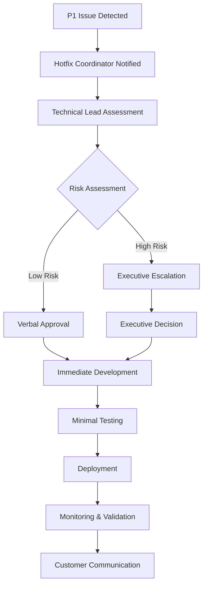
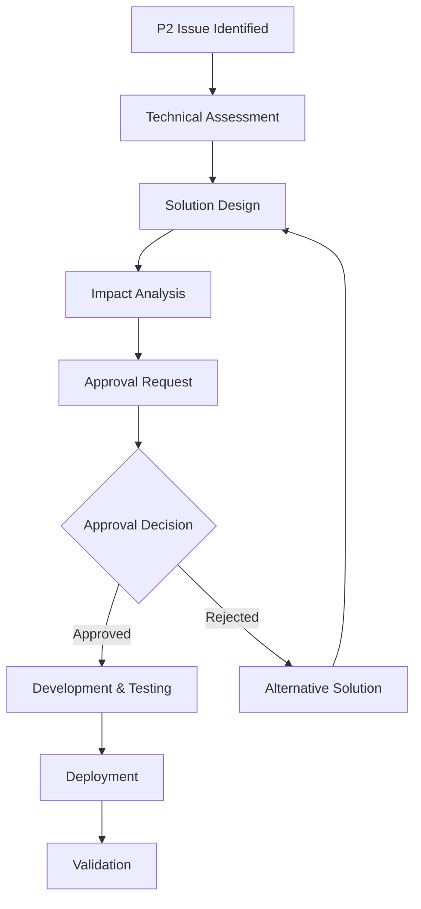

# Hotfix Plan & Ownership Matrix
**Phase**: 12 - Hypercare & Stabilization (aka: Post-Launch Support, Warranty Period, Hot Stage)
**Deliverable Type**: Emergency Response & Accountability Framework
**Template Purpose**: Clear ownership and procedures for rapid hotfix deployment during hypercare period
**Last Updated**: November 2025

## Executive Summary

*This document establishes clear ownership, procedures, and decision-making authority for hotfix deployments during NoteShare Pro's hypercare period. It defines roles, responsibilities, approval processes, and escalation paths to ensure rapid response to critical issues while maintaining system stability and quality standards.*

Hotfixes during hypercare require special attention due to the critical nature of early production stability and the need to balance speed with quality.

## Template Guidance

*Use this template to establish clear hotfix procedures and ownership during the hypercare period. Define specific roles, approval processes, and escalation paths to ensure rapid response to critical issues. Include both technical procedures and business decision-making processes to handle various scenarios that may arise.*

## Hotfix Classification System

### Severity Levels and Response Requirements

#### P1 - Critical Hotfixes (Immediate Response)
**Criteria**:
- System completely unavailable
- Data loss or corruption
- Security breach or vulnerability
- Payment processing failures
- Affects >50% of users

**Response Requirements**:
- **Detection to Deployment**: < 2 hours
- **Approval Process**: Expedited (verbal approval acceptable)
- **Testing Requirements**: Minimal viable testing
- **Communication**: Immediate stakeholder notification
- **Rollback Plan**: Mandatory, tested, and ready

#### P2 - High Priority Hotfixes (Same Day Response)
**Criteria**:
- Major feature completely broken
- Performance degradation >50%
- Integration failures with critical partners
- Affects 10-50% of users
- Customer-facing errors with business impact

**Response Requirements**:
- **Detection to Deployment**: < 8 hours
- **Approval Process**: Technical Lead + Product Manager
- **Testing Requirements**: Core functionality testing
- **Communication**: Stakeholder notification within 1 hour
- **Rollback Plan**: Required and validated

#### P3 - Medium Priority Hotfixes (Next Business Day)
**Criteria**:
- Minor feature issues with workarounds
- Performance issues affecting <10% of users
- Non-critical integration problems
- UI/UX issues causing confusion

**Response Requirements**:
- **Detection to Deployment**: < 24 hours
- **Approval Process**: Standard approval workflow
- **Testing Requirements**: Full regression testing
- **Communication**: Standard communication channels
- **Rollback Plan**: Standard rollback procedures

*Template Note: Customize severity levels and response requirements based on your business criticality and SLA commitments. Ensure clear criteria to avoid confusion during high-stress situations.*

## Ownership Matrix

### Primary Roles and Responsibilities

#### Hotfix Coordinator
**Primary**: Sarah Chen (Product Manager)
**Backup**: Marcus Rodriguez (Technical Lead)

**Responsibilities**:
- Overall hotfix process coordination
- Stakeholder communication and updates
- Business impact assessment and prioritization
- Go/no-go decision making for deployments
- Post-hotfix review coordination

**Authority Level**:
- Can approve P2 and P3 hotfixes
- Can escalate P1 hotfixes to executive team
- Can halt deployments if risks are identified
- Can allocate resources across teams

#### Technical Lead
**Primary**: Marcus Rodriguez (Senior Backend Engineer)
**Backup**: Jennifer Liu (Frontend Lead)

**Responsibilities**:
- Technical solution design and review
- Code quality assessment and approval
- Deployment execution and monitoring
- Technical risk assessment
- Team coordination and resource allocation

**Authority Level**:
- Can approve technical implementation approaches
- Can reject hotfixes based on technical risk
- Can escalate to architecture team for complex issues
- Can coordinate cross-team technical efforts

#### DevOps Lead
**Primary**: Lisa Park (Platform Engineer)
**Backup**: David Kim (Infrastructure Engineer)

**Responsibilities**:
- Deployment pipeline execution
- Infrastructure impact assessment
- Rollback execution if needed
- Performance monitoring during deployment
- Environment management and coordination

**Authority Level**:
- Can halt deployments for infrastructure concerns
- Can implement emergency infrastructure changes
- Can coordinate with cloud providers for critical issues
- Can approve infrastructure-related hotfixes

#### Quality Assurance Lead
**Primary**: Alex Chen (QA Manager)
**Backup**: Maria Santos (Senior QA Engineer)

**Responsibilities**:
- Hotfix testing strategy and execution
- Risk assessment for reduced testing scenarios
- Test environment management
- Quality gate enforcement
- Testing sign-off for deployments

**Authority Level**:
- Can reject hotfixes based on quality concerns
- Can approve reduced testing for P1 emergencies
- Can coordinate testing resources across teams
- Can escalate quality risks to technical leadership

*Template Note: Define clear primary and backup ownership for each role to ensure coverage during off-hours and vacation periods. Include specific authority levels to enable quick decision-making.*

### Team-Specific Responsibilities

#### Backend Development Team
**Team Lead**: Marcus Rodriguez
**Members**: 4 senior developers, 2 mid-level developers

**Hotfix Responsibilities**:
- API and service layer fixes
- Database schema and query optimizations
- Integration and third-party service issues
- Performance and scalability problems
- Security vulnerability patches

**On-Call Rotation**:
- Primary: Rotating weekly among senior developers
- Secondary: Technical lead always available
- Escalation: Architecture team for complex issues

#### Frontend Development Team
**Team Lead**: Jennifer Liu
**Members**: 3 senior developers, 3 mid-level developers

**Hotfix Responsibilities**:
- User interface and experience fixes
- Client-side performance issues
- Browser compatibility problems
- Mobile app critical issues
- User workflow and navigation problems

**On-Call Rotation**:
- Primary: Rotating among senior developers
- Secondary: Frontend lead backup coverage
- Escalation: UX team for design-related issues

#### Infrastructure/DevOps Team
**Team Lead**: Lisa Park
**Members**: 2 platform engineers, 1 security engineer

**Hotfix Responsibilities**:
- Server and infrastructure issues
- Deployment pipeline problems
- Monitoring and alerting fixes
- Security configuration issues
- Performance and capacity problems

**On-Call Rotation**:
- 24/7 coverage with primary/secondary rotation
- Escalation to cloud provider support when needed
- Coordination with security team for security issues

#### Customer Success Team
**Team Lead**: David Kim
**Members**: 3 customer success managers, 2 support specialists

**Hotfix Responsibilities**:
- Customer impact assessment and communication
- Workaround identification and documentation
- Customer escalation management
- Feedback collection and prioritization
- Post-hotfix customer satisfaction tracking

**Coverage**:
- Business hours coverage with on-call for P1 issues
- Escalation to product management for business decisions
- Coordination with sales team for enterprise customers

## Hotfix Approval Workflows

### P1 Critical Hotfix Approval (Emergency Process)



**Approval Authority for P1**:
- **Low Risk**: Hotfix Coordinator + Technical Lead (verbal approval)
- **High Risk**: VP Engineering or CTO approval required
- **Business Impact**: Product VP or CEO approval for customer-facing changes

### P2 High Priority Hotfix Approval (Standard Process)



**Approval Authority for P2**:
- **Technical Approval**: Technical Lead + DevOps Lead
- **Business Approval**: Hotfix Coordinator (Product Manager)
- **Quality Approval**: QA Lead sign-off required
- **Final Approval**: All three approvals required before deployment

### P3 Medium Priority Hotfix Approval (Full Process)

**Standard Development Process**:
- Full code review and testing cycle
- Standard approval workflow through development tools
- Scheduled deployment during maintenance windows
- Complete documentation and communication

*Template Note: Use flowcharts and clear approval matrices to eliminate confusion during high-stress hotfix situations.*

## Communication Protocols

### Internal Communication

#### Immediate Notification (P1 Issues)
**Notification Channels**:
- PagerDuty alert to on-call engineer
- Slack #hotfix-emergency channel
- Email to hypercare team distribution list
- SMS to hotfix coordinator and technical lead

**Information Required**:
- Issue severity and impact assessment
- Affected systems and user count
- Initial diagnosis and proposed solution
- Estimated timeline for resolution

#### Regular Updates (All Hotfixes)
**Update Frequency**:
- P1: Every 30 minutes during active work
- P2: Every 2 hours during business hours
- P3: Daily updates until resolution

**Update Template**:
```
HOTFIX UPDATE - [SEVERITY] - [TIMESTAMP]
Issue: [Brief description]
Status: [In Progress/Testing/Deploying/Resolved]
ETA: [Expected completion time]
Impact: [Current user/business impact]
Next Steps: [Immediate next actions]
```

### External Communication

#### Customer Communication Matrix

**P1 Critical Issues**:
- **Status Page**: Update within 15 minutes
- **Email Notification**: All affected customers within 30 minutes
- **Social Media**: Acknowledgment within 1 hour
- **Direct Outreach**: Enterprise customers within 1 hour

**P2 High Priority Issues**:
- **Status Page**: Update within 1 hour
- **Email Notification**: Affected customers within 2 hours
- **Support Ticket**: Proactive tickets for known affected customers
- **Account Management**: Enterprise customer notification

**P3 Medium Priority Issues**:
- **Release Notes**: Include in next scheduled update
- **Support Documentation**: Update help articles
- **Customer Success**: Include in regular check-ins

#### Communication Templates

**P1 Customer Notification Template**:
```
Subject: [URGENT] Service Issue - NoteShare Pro

Dear [Customer Name],

We are currently experiencing a service issue that may affect your ability to access NoteShare Pro. 

Issue: [Brief, non-technical description]
Impact: [What customers are experiencing]
Status: [What we're doing to fix it]
ETA: [Expected resolution time]

We will provide updates every 30 minutes until resolved. You can check our status page at [URL] for real-time updates.

We sincerely apologize for any inconvenience.

NoteShare Pro Team
```

*Template Note: Prepare communication templates in advance to ensure consistent, professional messaging during high-stress situations.*

## Deployment Procedures

### Hotfix Development Process

#### Code Development Standards
**P1 Emergency Standards**:
- Minimum viable fix approach
- Single issue focus (no scope creep)
- Peer review required (can be post-deployment)
- Automated testing where possible
- Manual testing for critical paths only

**P2/P3 Standards**:
- Full code review process
- Comprehensive testing suite
- Documentation updates required
- Security review for security-related fixes
- Performance impact assessment

#### Testing Requirements

**P1 Critical Testing**:
- Smoke testing of core functionality
- Verification that fix resolves the issue
- Basic regression testing of related features
- Load testing if performance-related
- Rollback procedure validation

**P2 High Priority Testing**:
- Full regression testing of affected areas
- Integration testing with related systems
- User acceptance testing for UI changes
- Performance testing for performance fixes
- Security testing for security-related changes

**P3 Medium Priority Testing**:
- Complete test suite execution
- Cross-browser/device testing
- Accessibility testing if UI-related
- Documentation testing
- End-to-end workflow validation

### Deployment Execution

#### Pre-Deployment Checklist
- [ ] Fix has been tested and approved
- [ ] Rollback plan is prepared and tested
- [ ] Monitoring alerts are configured
- [ ] Customer communication is prepared
- [ ] Team is available for monitoring
- [ ] Backup systems are verified operational

#### Deployment Steps
1. **Pre-deployment verification**: Confirm all systems healthy
2. **Deployment execution**: Follow standard deployment procedures
3. **Immediate monitoring**: Watch key metrics for 15 minutes
4. **Functionality verification**: Test fix in production
5. **Performance monitoring**: Verify no performance degradation
6. **Customer communication**: Update status and notify resolution

#### Post-Deployment Monitoring
**Immediate (0-2 hours)**:
- Error rate monitoring
- Performance metric tracking
- User feedback monitoring
- System health verification

**Extended (2-24 hours)**:
- Trend analysis for any degradation
- Customer satisfaction tracking
- Support ticket volume monitoring
- Business metric impact assessment

*Template Note: Establish clear deployment procedures that balance speed with quality based on the severity of the issue.*

## Rollback Procedures

### Rollback Decision Criteria

#### Automatic Rollback Triggers
- Error rate increase >5x baseline
- Response time degradation >200%
- System availability drops below 99%
- Critical business metric failure
- Security vulnerability introduction

#### Manual Rollback Triggers
- Customer escalations increase significantly
- Unexpected side effects discovered
- Performance degradation beyond acceptable levels
- Data integrity concerns identified
- Business stakeholder request

### Rollback Execution

#### Immediate Rollback (< 15 minutes)
1. **Decision**: Technical Lead or DevOps Lead authority
2. **Execution**: Automated rollback via deployment pipeline
3. **Verification**: Confirm system returns to previous state
4. **Communication**: Immediate notification to stakeholders
5. **Analysis**: Begin root cause analysis of rollback need

#### Rollback Communication Template
```
HOTFIX ROLLBACK NOTIFICATION

Hotfix: [Description]
Rollback Time: [Timestamp]
Reason: [Brief explanation]
Current Status: [System state after rollback]
Next Steps: [Investigation and re-fix plan]
Impact: [Customer impact during rollback]
```

*Template Note: Prepare rollback procedures in advance and ensure they are tested and ready for immediate execution.*

## Escalation Matrix

### Technical Escalation

#### Level 1: Team Level
- **Scope**: Standard hotfixes within team expertise
- **Authority**: Team leads can approve and execute
- **Escalation Trigger**: Cross-team dependencies or complex architecture issues

#### Level 2: Technical Leadership
- **Scope**: Complex technical issues requiring architectural decisions
- **Authority**: Technical Lead, DevOps Lead, QA Lead coordination
- **Escalation Trigger**: Business impact or resource allocation needs

#### Level 3: Engineering Management
- **Scope**: Resource allocation, timeline, or business impact decisions
- **Authority**: VP Engineering, Product VP coordination
- **Escalation Trigger**: Executive stakeholder involvement needed

#### Level 4: Executive Leadership
- **Scope**: Company-wide impact, customer relationship, or PR concerns
- **Authority**: CTO, CEO involvement
- **Escalation Trigger**: Major customer impact or public attention

### Business Escalation

#### Customer Impact Escalation
- **Minor Impact** (<10 users): Standard support process
- **Moderate Impact** (10-100 users): Customer Success Manager notification
- **Major Impact** (>100 users): Account Management and executive notification
- **Enterprise Impact**: Direct executive customer communication

#### Revenue Impact Escalation
- **<$1K Impact**: Standard process
- **$1K-$10K Impact**: Product Manager notification
- **$10K-$100K Impact**: VP-level notification
- **>$100K Impact**: Executive team involvement

*Template Note: Define clear escalation criteria and paths to ensure appropriate resources are engaged based on the severity and impact of issues.*

## Performance Metrics

### Hotfix Response Metrics

#### Response Time Tracking
- **Detection to Acknowledgment**: Target <5 minutes
- **Acknowledgment to Assessment**: Target <15 minutes
- **Assessment to Solution**: Target varies by severity
- **Solution to Deployment**: Target varies by severity
- **Deployment to Verification**: Target <30 minutes

#### Quality Metrics
- **Hotfix Success Rate**: Target >95%
- **Rollback Rate**: Target <5%
- **Repeat Issue Rate**: Target <10%
- **Customer Satisfaction**: Target >4.0/5.0

#### Business Impact Metrics
- **Revenue Impact per Incident**: Track and minimize
- **Customer Churn from Incidents**: Target <1%
- **Support Ticket Volume**: Monitor for spikes
- **Brand Reputation Impact**: Monitor social media and reviews

### Continuous Improvement

#### Weekly Hotfix Reviews
- Review all hotfixes from previous week
- Analyze response times and effectiveness
- Identify process improvement opportunities
- Update procedures based on learnings

#### Monthly Process Assessment
- Overall hotfix program effectiveness
- Team performance and satisfaction
- Customer impact and satisfaction trends
- Process optimization recommendations

*Template Note: Track metrics to ensure the hotfix process is effective and continuously improving.*

## Appendices

### A. Contact Information
*Template Note: Include emergency contact information for all team members and escalation contacts.*

### B. System Architecture Diagrams
*Template Note: Reference current system architecture to help with impact assessment during hotfixes.*

### C. Deployment Pipeline Documentation
*Template Note: Include detailed deployment procedures and rollback mechanisms.*

### D. Customer Communication Scripts
*Template Note: Provide scripts for various customer communication scenarios during hotfixes.*